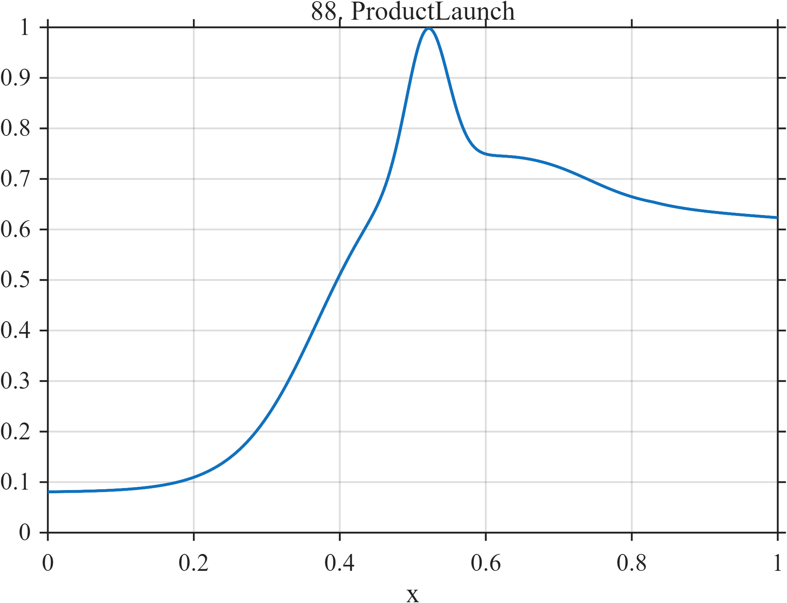

# TF088 — ProductLaunch

## Overview

The **ProductLaunch** signal follows a smooth sigmoidal adoption trend with a narrow viral burst, later saturation adjustment, and mild terminal decay.

## Mathematical Definition

Let $s(x;c,w)=[1+e^{-(x-c)/w}]^{-1}$ and $g(x;c,w)=e^{-((x-c)/w)^2/2}$. Then

$$
f(x)=0.08+0.68s(x;0.37,0.055)+0.28g(x;0.52,0.028)-0.12s(x;0.74,0.045)-0.10(x-0.83)_+.
$$

## Morphological Characteristics

| Property | Description |
|---|---|
| Primary family | Sigmoidal adoption plus localized burst |
| Viral excursion | Narrow peak near $x=0.52$ |
| Late behavior | Saturation adjustment and mild decay |
| Main challenge | Preserving a short launch burst on a long adoption trend |

## Parameters

| Parameter | Meaning | Default |
|---|---|---:|
| $0.37$ | Adoption midpoint | 0.37 |
| $0.52$ | Viral-burst center | 0.52 |
| $0.028$ | Viral-burst width | 0.028 |

## MATLAB Implementation

~~~matlab
N=1024; x=linspace(0,1,N); s=@(z,c,w) 1./(1+exp(-(z-c)/w));
f=0.08+0.68*s(x,0.37,0.055)+0.28*exp(-0.5*((x-0.52)/0.028).^2);
f=f-0.12*s(x,0.74,0.045)-0.10*max(x-0.83,0);
plot(x,f); grid on; title('TF088 — ProductLaunch')
exportgraphics(gcf,'TF088_ProductLaunch.png','Resolution',300);
~~~

## Python Implementation

~~~python
import numpy as np
import matplotlib.pyplot as plt
N=1024; x=np.linspace(0,1,N); s=lambda c,w: 1/(1+np.exp(-(x-c)/w))
f=.08+.68*s(.37,.055)+.28*np.exp(-.5*((x-.52)/.028)**2)
f-=.12*s(.74,.045)+.10*np.maximum(x-.83,0)
plt.plot(x,f); plt.grid(alpha=.3); plt.tight_layout()
plt.savefig('TF088_ProductLaunch.png',dpi=300)
~~~

## Recommended Uses

- Adoption-curve denoising
- Local-burst preservation
- Trend and saturation recovery

## Provenance

**Status:** Product-adoption-inspired deterministic surrogate.

---

[← Previous: PromoDemand](TF087_PromoDemand.md) | [Category 6 Catalog](index.md) | [Next: AdstockCampaign →](TF089_AdstockCampaign.md)
