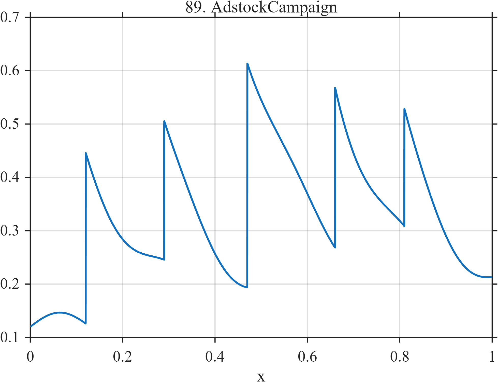

# TF089 — AdstockCampaign

## Overview

The **AdstockCampaign** signal sums five unequal campaign impulses with different exponential carry-over rates, producing overlapping responses and shoulders on a weak baseline.

## Mathematical Definition

For campaign times $c_k$, amplitudes $a_k$, and decay rates $r_k$,

$$
f(x)=0.12+0.025x+0.025\sin(8\pi x)+\sum_{k=1}^{5}a_k I(x\ge c_k)e^{-r_k(x-c_k)},
$$

with

$$
c=(0.12,0.29,0.47,0.66,0.81),\quad
a=(0.32,0.26,0.42,0.30,0.22),\quad
r=(7,9,6,8.5,10).
$$

## Morphological Characteristics

| Property | Description |
|---|---|
| Primary family | Overlapping causal impulse responses |
| Events | Five abrupt campaign onsets |
| Persistence | Unequal exponential carry-over |
| Main challenge | Resolving distinct interventions in accumulated smooth response |

## Parameters

| Parameter | Meaning | Default |
|---|---|---:|
| $c_k$ | Campaign times | As above |
| $a_k$ | Initial effects | As above |
| $r_k$ | Carry-over decay rates | As above |

## MATLAB Implementation

~~~matlab
N=1024; x=linspace(0,1,N); f=0.12+0.025*x;
c=[0.12 0.29 0.47 0.66 0.81]; a=[0.32 0.26 0.42 0.30 0.22]; r=[7 9 6 8.5 10];
for k=1:numel(c)
    u=max(x-c(k),0); f=f+a(k)*(x>=c(k)).*exp(-r(k)*u);
end
f=f+0.025*sin(2*pi*4*x);
plot(x,f); grid on; title('TF089 — AdstockCampaign')
exportgraphics(gcf,'TF089_AdstockCampaign.png','Resolution',300);
~~~

## Python Implementation

~~~python
import numpy as np
import matplotlib.pyplot as plt
N=1024; x=np.linspace(0,1,N); f=.12+.025*x
c=[.12,.29,.47,.66,.81]; a=[.32,.26,.42,.30,.22]; r=[7,9,6,8.5,10]
for ck,ak,rk in zip(c,a,r):
    u=np.maximum(x-ck,0); f+=ak*(x>=ck)*np.exp(-rk*u)
f+=.025*np.sin(2*np.pi*4*x)
plt.plot(x,f); plt.grid(alpha=.3); plt.tight_layout()
plt.savefig('TF089_AdstockCampaign.png',dpi=300)
~~~

## Recommended Uses

- Intervention-response denoising
- Change-onset preservation
- Overlapping-carry-over analysis

## Provenance

**Status:** Advertising-adstock-inspired deterministic surrogate.

---

[← Previous: ProductLaunch](TF088_ProductLaunch.md) | [Category 6 Catalog](index.md) | [Next: MarketFlashCrash →](TF090_MarketFlashCrash.md)
