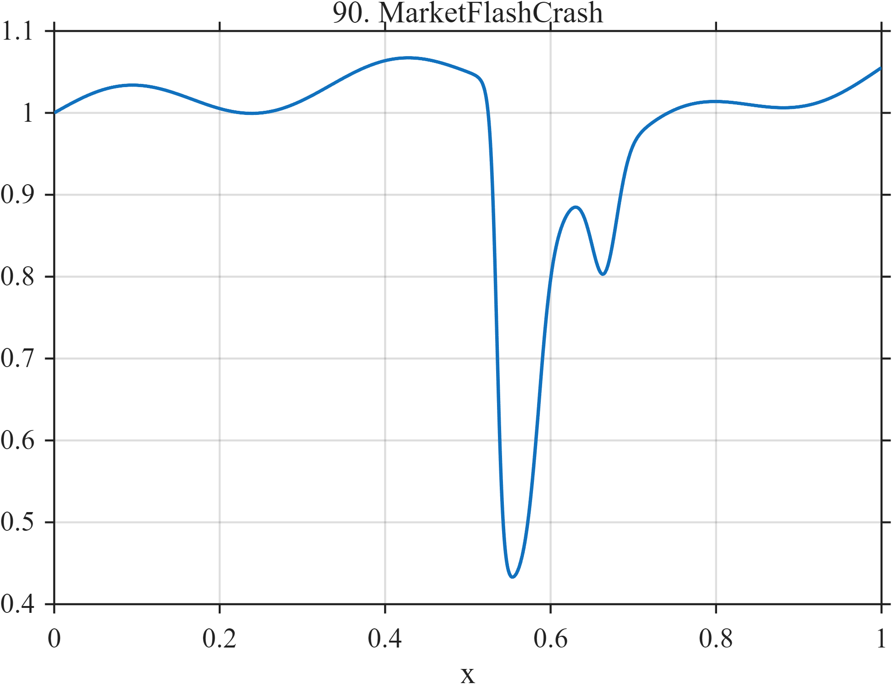

# TF090 — MarketFlashCrash

## Overview

The **MarketFlashCrash** signal combines gradual price-like movement, an abrupt loss, rapid partial rebound, a smaller aftershock, and slow normalization.

## Mathematical Definition

Let $s(x;c,w)=[1+e^{-(x-c)/w}]^{-1}$ and $g(x;c,w)=e^{-((x-c)/w)^2/2}$. Then

$$
\begin{aligned}
f(x)={}&1+0.10x+0.025\sin(6\pi x)-0.62s(x;0.535,0.004)\\
&+0.44s(x;0.585,0.009)-0.13g(x;0.665,0.015)\\
&+0.16I(x\ge0.585)[1-e^{-4.5(x-0.585)}].
\end{aligned}
$$

## Morphological Characteristics

| Property | Description |
|---|---|
| Primary family | Abrupt crash and asymmetric recovery |
| Crash | Near $x=0.535$ |
| Recovery | Partial rebound near 0.585 plus slow normalization |
| Main challenge | Preserving downside and rebound without ringing artifacts |

## Parameters

| Parameter | Meaning | Default |
|---|---|---:|
| $-0.62$ | Crash magnitude | -0.62 |
| $0.44$ | Rapid rebound magnitude | 0.44 |
| $0.665$ | Aftershock center | 0.665 |

## MATLAB Implementation

~~~matlab
N=1024; x=linspace(0,1,N); s=@(z,c,w) 1./(1+exp(-(z-c)/w));
pre=1+0.10*x+0.025*sin(2*pi*3*x);
crash=-0.62*s(x,0.535,0.004); rebound=0.44*s(x,0.585,0.009);
aftershock=-0.13*exp(-0.5*((x-0.665)/0.015).^2);
u=max(x-0.585,0); normalization=(x>=0.585).*0.16.*(1-exp(-4.5*u));
f=pre+crash+rebound+aftershock+normalization;
plot(x,f); grid on; title('TF090 — MarketFlashCrash')
exportgraphics(gcf,'TF090_MarketFlashCrash.png','Resolution',300);
~~~

## Python Implementation

~~~python
import numpy as np
import matplotlib.pyplot as plt
N=1024; x=np.linspace(0,1,N); s=lambda c,w: 1/(1+np.exp(-(x-c)/w))
pre=1+.10*x+.025*np.sin(2*np.pi*3*x); crash=-.62*s(.535,.004); rebound=.44*s(.585,.009)
aftershock=-.13*np.exp(-.5*((x-.665)/.015)**2)
u=np.maximum(x-.585,0); normalization=(x>=.585)*.16*(1-np.exp(-4.5*u))
f=pre+crash+rebound+aftershock+normalization
plt.plot(x,f); plt.grid(alpha=.3); plt.tight_layout()
plt.savefig('TF090_MarketFlashCrash.png',dpi=300)
~~~

## Recommended Uses

- Abrupt-break denoising
- Asymmetric-recovery preservation
- Ringing-artifact assessment

## Provenance

**Status:** Flash-crash-morphology-inspired deterministic financial surrogate.

---

[← Previous: AdstockCampaign](TF089_AdstockCampaign.md) | [Category 6 Catalog](index.md) | [Next: InventoryStockout →](TF091_InventoryStockout.md)
