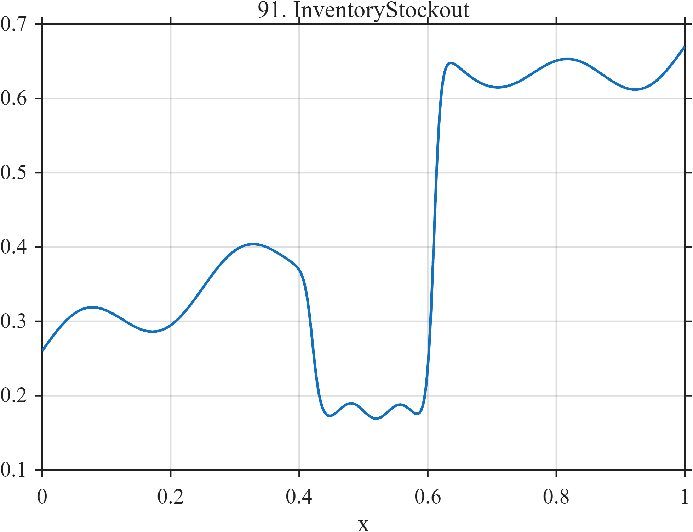

# TF091 — InventoryStockout

## Overview

The **InventoryStockout** signal follows a smooth increasing trajectory, enters a low nearly flat stockout interval, then jumps at replenishment and gradually returns toward ordinary behavior.

## Mathematical Definition

Let $s(x;c,w)=[1+e^{-(x-c)/w}]^{-1}$ and $W(x)=s(x;0.42,0.006)-s(x;0.61,0.006)$. Define

$$
b(x)=0.26+0.34x+0.035\sin(8\pi x),\qquad q(x)=0.18+0.010\sin(26\pi x).
$$

Then

$$
f(x)=b(x)[1-W(x)]+q(x)W(x)+0.20s(x;0.61,0.005)-0.13s(x;0.72,0.040).
$$

## Morphological Characteristics

| Property | Description |
|---|---|
| Primary family | Trend interrupted by finite plateau |
| Stockout interval | Approximately 0.42–0.61 |
| Replenishment | Sharp upward transition near 0.61 |
| Main challenge | Preserving plateau boundaries and post-stockout adjustment |

## Parameters

| Parameter | Meaning | Default |
|---|---|---:|
| $0.42,0.61$ | Stockout boundaries | As shown |
| $0.20$ | Replenishment jump | 0.20 |
| $0.13$ | Later adjustment magnitude | 0.13 |

## MATLAB Implementation

~~~matlab
N=1024; x=linspace(0,1,N); s=@(z,c,w) 1./(1+exp(-(z-c)/w));
base=0.26+0.34*x+0.035*sin(2*pi*4*x);
W=s(x,0.42,0.006)-s(x,0.61,0.006);
stock=0.18+0.010*sin(2*pi*13*x);
f=base.*(1-W)+stock.*W+0.20*s(x,0.61,0.005)-0.13*s(x,0.72,0.040);
plot(x,f); grid on; title('TF091 — InventoryStockout')
exportgraphics(gcf,'TF091_InventoryStockout.png','Resolution',300);
~~~

## Python Implementation

~~~python
import numpy as np
import matplotlib.pyplot as plt
N=1024; x=np.linspace(0,1,N); s=lambda c,w: 1/(1+np.exp(-(x-c)/w))
base=.26+.34*x+.035*np.sin(2*np.pi*4*x); W=s(.42,.006)-s(.61,.006)
stock=.18+.010*np.sin(2*np.pi*13*x)
f=base*(1-W)+stock*W+.20*s(.61,.005)-.13*s(.72,.040)
plt.plot(x,f); plt.grid(alpha=.3); plt.tight_layout()
plt.savefig('TF091_InventoryStockout.png',dpi=300)
~~~

## Recommended Uses

- Plateau and boundary recovery
- Inventory-series denoising
- Replenishment-change preservation

## Provenance

**Status:** Inventory-and-demand-inspired deterministic surrogate.

---

[← Previous: MarketFlashCrash](TF090_MarketFlashCrash.md) | [Category 6 Catalog](index.md) | [Next: PercussiveAttackDecay →](TF092_PercussiveAttackDecay.md)
