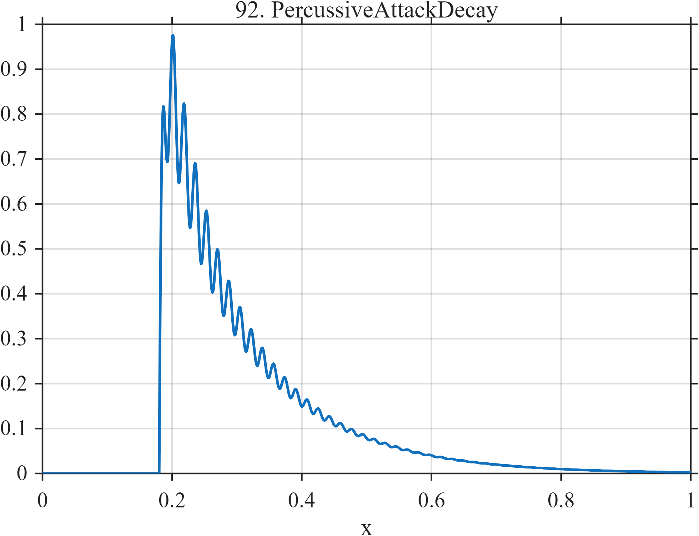

# TF092 — PercussiveAttackDecay

## Overview

The **PercussiveAttackDecay** signal has a very sharp onset, a mixture of fast and slow amplitude decay, and damped resonant ringing.

## Mathematical Definition

Let $t_0=0.18$, $u=(x-t_0)_+$, and

$$
a(x)=1.10I(x\ge t_0)[1-e^{-180u}].
$$

Then

$$
f(x)=a(x)[0.68e^{-7u}+0.32e^{-24u}]+0.18I(x\ge t_0)e^{-12u}\sin(2\pi\,58u).
$$

## Morphological Characteristics

| Property | Description |
|---|---|
| Primary family | Sharp attack and multirate decay |
| Onset | $t_0=0.18$ |
| Fine structure | Damped 58-cycle resonant component |
| Main challenge | Preserving an onset much sharper than its decay envelope |

## Parameters

| Parameter | Meaning | Default |
|---|---|---:|
| $180$ | Attack rate | 180 |
| $7,24$ | Envelope decay rates | As shown |
| $12$ | Ringing decay rate | 12 |

## MATLAB Implementation

~~~matlab
N=1024; x=linspace(0,1,N); t0=0.18; u=max(x-t0,0);
attack=1.10*(1-exp(-180*u)).*(x>=t0);
decay=attack.*(0.68*exp(-7*u)+0.32*exp(-24*u));
ring=(x>=t0).*0.18.*exp(-12*u).*sin(2*pi*58*u);
f=decay+ring;
plot(x,f); grid on; title('TF092 — PercussiveAttackDecay')
exportgraphics(gcf,'TF092_PercussiveAttackDecay.png','Resolution',300);
~~~

## Python Implementation

~~~python
import numpy as np
import matplotlib.pyplot as plt
N=1024; x=np.linspace(0,1,N); t0=.18; u=np.maximum(x-t0,0)
attack=1.10*(1-np.exp(-180*u))*(x>=t0)
decay=attack*(.68*np.exp(-7*u)+.32*np.exp(-24*u))
ring=(x>=t0)*.18*np.exp(-12*u)*np.sin(2*np.pi*58*u); f=decay+ring
plt.plot(x,f); plt.grid(alpha=.3); plt.tight_layout()
plt.savefig('TF092_PercussiveAttackDecay.png',dpi=300)
~~~

## Recommended Uses

- Audio-transient denoising
- Attack localization
- Resonant-tail preservation

## Provenance

**Status:** Percussive-acoustics-inspired deterministic surrogate.

---

[← Previous: InventoryStockout](TF091_InventoryStockout.md) | [Category 6 Catalog](index.md) | [Next: VibratoTone →](TF093_VibratoTone.md)
