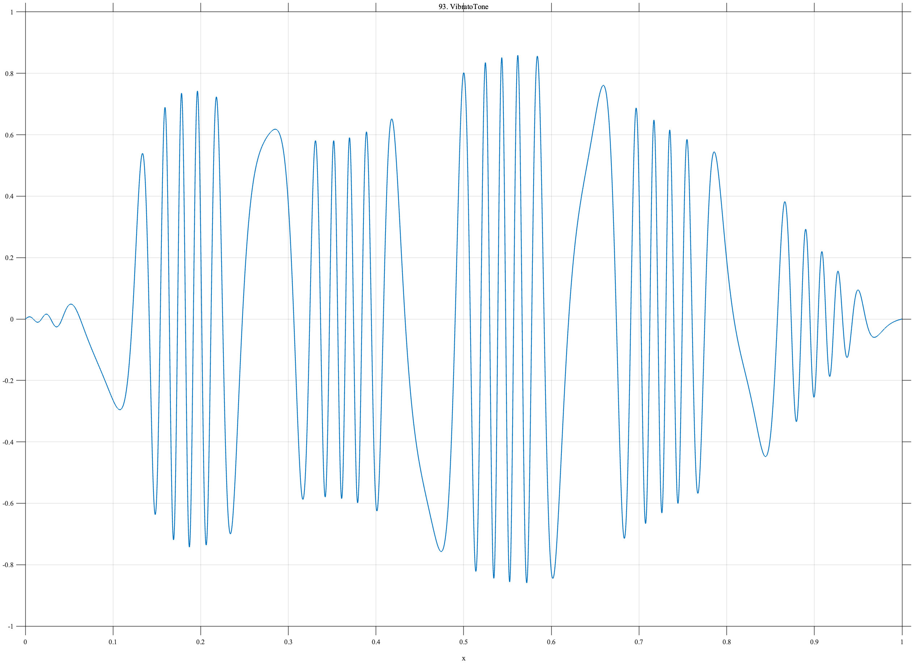

# TF093 — VibratoTone

## Overview

The **VibratoTone** signal has a smooth attack and release, periodic frequency modulation of its carrier, and simultaneous slower amplitude modulation.

## Mathematical Definition

Let $s(x;c,w)=[1+e^{-(x-c)/w}]^{-1}$ and

$$
E(x)=s(x;0.12,0.025)-s(x;0.88,0.035),
$$

$$
\phi(x)=2\pi[30x+0.75\sin(2\pi\,5.5x)],\qquad
A(x)=0.72+0.14\sin(2\pi\,2.2x).
$$

The signal is $f(x)=E(x)A(x)\sin\phi(x)$.

## Morphological Characteristics

| Property | Description |
|---|---|
| Primary family | Frequency- and amplitude-modulated oscillation |
| Envelope | Smooth onset near 0.12 and release near 0.88 |
| Carrier | 30-cycle nominal tone with 5.5-cycle vibrato |
| Main challenge | Preserving coherent modulation rather than isolated features |

## Parameters

| Parameter | Meaning | Default |
|---|---|---:|
| $30$ | Nominal carrier cycles | 30 |
| $5.5$ | Vibrato cycles | 5.5 |
| $2.2$ | Amplitude-modulation cycles | 2.2 |

## MATLAB Implementation

~~~matlab
N=1024; x=linspace(0,1,N); s=@(z,c,w) 1./(1+exp(-(z-c)/w));
env=s(x,0.12,0.025)-s(x,0.88,0.035);
phase=2*pi*(30*x+0.75*sin(2*pi*5.5*x));
amp=0.72+0.14*sin(2*pi*2.2*x);
f=env.*amp.*sin(phase);
plot(x,f); grid on; title('TF093 — VibratoTone')
exportgraphics(gcf,'TF093_VibratoTone.png','Resolution',300);
~~~

## Python Implementation

~~~python
import numpy as np
import matplotlib.pyplot as plt
N=1024; x=np.linspace(0,1,N); s=lambda c,w: 1/(1+np.exp(-(x-c)/w))
env=s(.12,.025)-s(.88,.035); phase=2*np.pi*(30*x+.75*np.sin(2*np.pi*5.5*x))
amp=.72+.14*np.sin(2*np.pi*2.2*x); f=env*amp*np.sin(phase)
plt.plot(x,f); plt.grid(alpha=.3); plt.tight_layout()
plt.savefig('TF093_VibratoTone.png',dpi=300)
~~~

## Recommended Uses

- Modulated-tone denoising
- Instantaneous-frequency preservation
- Smooth-envelope recovery

## Provenance

**Status:** Musical-vibrato-inspired deterministic surrogate.

---

[← Previous: PercussiveAttackDecay](TF092_PercussiveAttackDecay.md) | [Category 6 Catalog](index.md) | [Next: ChordBeating →](TF094_ChordBeating.md)
