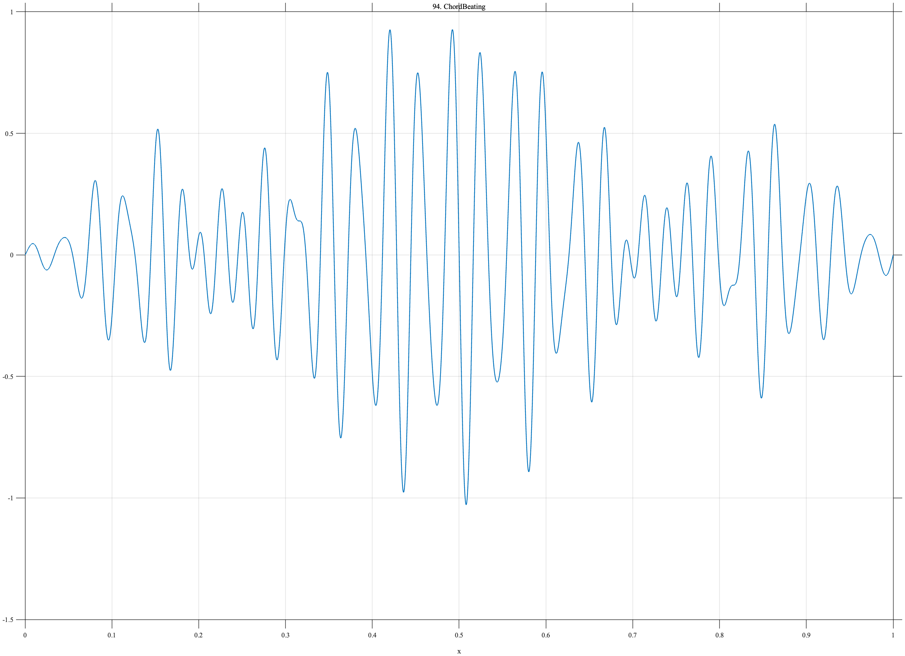

# TF094 — ChordBeating

## Overview

The **ChordBeating** signal sums three nearby or related tones beneath a smooth audio envelope, producing interference and a slowly varying beat pattern.

## Mathematical Definition

Let

$$
E(x)=s(x;0.10,0.030)-s(x;0.90,0.040),\qquad
s(x;c,w)=[1+e^{-(x-c)/w}]^{-1}.
$$

Then

$$
f(x)=E(x)[0.42\sin(2\pi\,27x)+0.39\sin(2\pi\,29x+0.2)+0.23\sin(2\pi\,41x-0.4)].
$$

## Morphological Characteristics

| Property | Description |
|---|---|
| Primary family | Multitone oscillation with beating |
| Tone frequencies | 27, 29, and 41 cycles |
| Envelope | Smooth onset and release |
| Main challenge | Retaining carriers and their low-frequency interference pattern |

## Parameters

| Parameter | Meaning | Default |
|---|---|---:|
| $27,29,41$ | Component cycle counts | As shown |
| $0.42,0.39,0.23$ | Component amplitudes | As shown |

## MATLAB Implementation

~~~matlab
N=1024; x=linspace(0,1,N); s=@(z,c,w) 1./(1+exp(-(z-c)/w));
env=s(x,0.10,0.030)-s(x,0.90,0.040);
f=env.*(0.42*sin(2*pi*27*x)+0.39*sin(2*pi*29*x+0.2)+0.23*sin(2*pi*41*x-0.4));
plot(x,f); grid on; title('TF094 — ChordBeating')
exportgraphics(gcf,'TF094_ChordBeating.png','Resolution',300);
~~~

## Python Implementation

~~~python
import numpy as np
import matplotlib.pyplot as plt
N=1024; x=np.linspace(0,1,N); s=lambda c,w: 1/(1+np.exp(-(x-c)/w))
env=s(.10,.030)-s(.90,.040)
f=env*(.42*np.sin(2*np.pi*27*x)+.39*np.sin(2*np.pi*29*x+.2)+.23*np.sin(2*np.pi*41*x-.4))
plt.plot(x,f); plt.grid(alpha=.3); plt.tight_layout()
plt.savefig('TF094_ChordBeating.png',dpi=300)
~~~

## Recommended Uses

- Multitone denoising
- Beat-envelope preservation
- Close-frequency separation

## Provenance

**Status:** Musical-chord-and-beating-inspired deterministic surrogate.

---

[← Previous: VibratoTone](TF093_VibratoTone.md) | [Category 6 Catalog](index.md) | [Next: SpeechFormantTransition →](TF095_SpeechFormantTransition.md)
