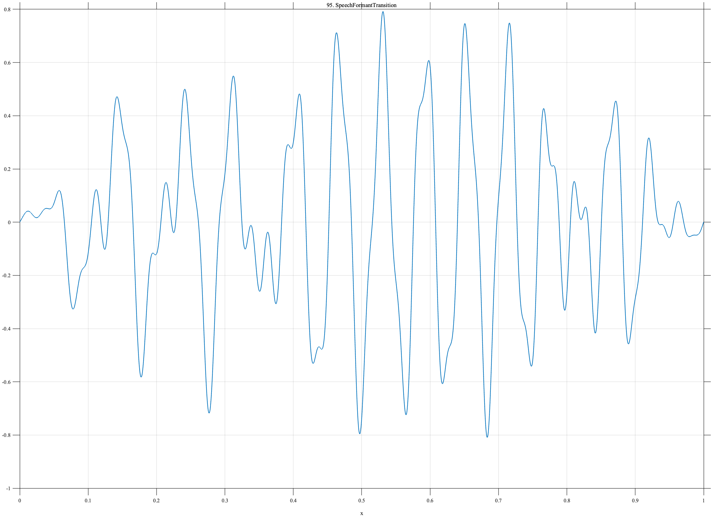

# TF095 — SpeechFormantTransition

## Overview

The **SpeechFormantTransition** signal combines three oscillatory components whose frequencies move differently through time, under a smooth global and broad local envelope.

## Mathematical Definition

Let $s(x;c,w)=[1+e^{-(x-c)/w}]^{-1}$,

$$
E(x)=[s(x;0.07,0.025)-s(x;0.93,0.030)]
[0.78+0.22e^{-((x-0.58)/0.22)^2/2}],
$$

and

$$
\phi_1=2\pi(8x+7x^2),\quad
\phi_2=2\pi(22x-5x^2),\quad
\phi_3=2\pi(38x+4x^2).
$$

Then

$$
f(x)=E(x)[0.42\sin\phi_1+0.27\sin(\phi_2+0.3)+0.14\sin(\phi_3-0.5)].
$$

## Morphological Characteristics

| Property | Description |
|---|---|
| Primary family | Multiple nonstationary oscillatory bands |
| Frequency trends | Two increasing and one decreasing phase rate |
| Envelope | Smooth endpoints with broad emphasis near 0.58 |
| Main challenge | Preserving distributed, time-varying spectral structure |

## Parameters

| Parameter | Meaning | Default |
|---|---|---:|
| $8,22,38$ | Base phase coefficients | As shown |
| $7,-5,4$ | Quadratic phase coefficients | As shown |
| $0.42,0.27,0.14$ | Band amplitudes | As shown |

## MATLAB Implementation

~~~matlab
N=1024; x=linspace(0,1,N); s=@(z,c,w) 1./(1+exp(-(z-c)/w));
env=s(x,0.07,0.025)-s(x,0.93,0.030);
ph1=2*pi*(8*x+7*x.^2); ph2=2*pi*(22*x-5*x.^2); ph3=2*pi*(38*x+4*x.^2);
f=env.*(0.42*sin(ph1)+0.27*sin(ph2+0.3)+0.14*sin(ph3-0.5));
f=f.*(0.78+0.22*exp(-0.5*((x-0.58)/0.22).^2));
plot(x,f); grid on; title('TF095 — SpeechFormantTransition')
exportgraphics(gcf,'TF095_SpeechFormantTransition.png','Resolution',300);
~~~

## Python Implementation

~~~python
import numpy as np
import matplotlib.pyplot as plt
N=1024; x=np.linspace(0,1,N); s=lambda c,w: 1/(1+np.exp(-(x-c)/w))
env=s(.07,.025)-s(.93,.030)
ph1=2*np.pi*(8*x+7*x**2); ph2=2*np.pi*(22*x-5*x**2); ph3=2*np.pi*(38*x+4*x**2)
f=env*(.42*np.sin(ph1)+.27*np.sin(ph2+.3)+.14*np.sin(ph3-.5))
f*=.78+.22*np.exp(-.5*((x-.58)/.22)**2)
plt.plot(x,f); plt.grid(alpha=.3); plt.tight_layout()
plt.savefig('TF095_SpeechFormantTransition.png',dpi=300)
~~~

## Recommended Uses

- Nonstationary speech-like denoising
- Moving-band preservation
- Time-frequency structure recovery

## Provenance

**Status:** Speech-formant-transition-inspired deterministic surrogate; not a recording.

---

[← Previous: ChordBeating](TF094_ChordBeating.md) | [Category 6 Catalog](index.md) | [Next: AudioIntro →](TF096_AudioIntro.md)
