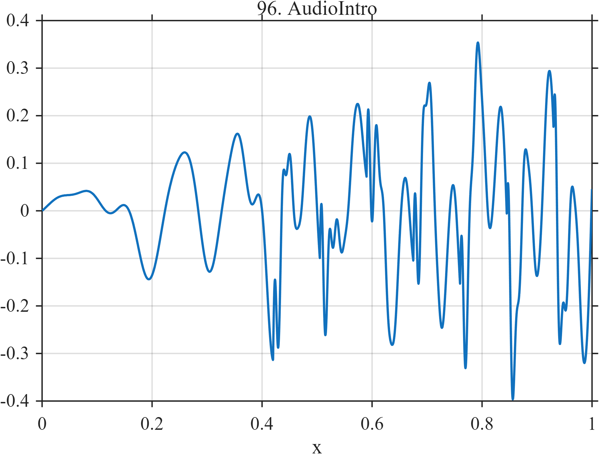

# TF096 — AudioIntro

## Overview

The **AudioIntro** signal is an original generic musical-intro surrogate with ambient motion, successive bass and harmonic entries, repeated percussive attacks, and a mild chirped crescendo.

## Mathematical Definition

Let $s(x;c,w)=[1+e^{-(x-c)/w}]^{-1}$ and

$$
\mathcal C=(0.420,0.505,0.590,0.675,0.760,0.845,0.930).
$$

Then

$$
\begin{aligned}
f(x)={}&0.04\sin(8\pi x)+0.14s(x;0.18,0.020)\sin(18\pi x)\\
&+0.12s(x;0.38,0.025)\sin(46\pi x+0.4)\\
&+\sum_{c\in\mathcal C}0.20I(x\ge c)e^{-70(x-c)}\sin[2\pi\,70(x-c)]\\
&+0.10x\sin[2\pi(14x+5x^2)].
\end{aligned}
$$

## Morphological Characteristics

| Property | Description |
|---|---|
| Primary family | Layered tonal and transient structure |
| Entries | Ambient, bass, and harmonic layers |
| Transients | Seven damped percussive attacks |
| Main challenge | Preserving simultaneous smooth, oscillatory, and impulsive components |

## Parameters

| Parameter | Meaning | Default |
|---|---|---:|
| $0.18,0.38$ | Layer-entry locations | As shown |
| $\mathcal C$ | Percussive beat centers | As above |
| $70$ | Percussive frequency and decay rate | 70 |

## MATLAB Implementation

~~~matlab
N=1024; x=linspace(0,1,N); s=@(z,c,w) 1./(1+exp(-(z-c)/w));
amb=0.04*sin(2*pi*4*x);
bass=0.14*s(x,0.18,0.020).*sin(2*pi*9*x);
harm=0.12*s(x,0.38,0.025).*sin(2*pi*23*x+0.4);
rhythm=zeros(size(x)); beatCenters=0.42:0.085:0.96;
for k=1:numel(beatCenters)
    c=beatCenters(k); u=max(x-c,0);
    rhythm=rhythm+0.20*(x>=c).*exp(-70*u).*sin(2*pi*70*u);
end
crescendo=0.10*x.*sin(2*pi*(14*x+5*x.^2));
f=amb+bass+harm+rhythm+crescendo;
plot(x,f); grid on; title('TF096 — AudioIntro')
exportgraphics(gcf,'TF096_AudioIntro.png','Resolution',300);
~~~

## Python Implementation

~~~python
import numpy as np
import matplotlib.pyplot as plt
N=1024; x=np.linspace(0,1,N); s=lambda c,w: 1/(1+np.exp(-(x-c)/w))
amb=.04*np.sin(2*np.pi*4*x); bass=.14*s(.18,.020)*np.sin(2*np.pi*9*x)
harm=.12*s(.38,.025)*np.sin(2*np.pi*23*x+.4); rhythm=np.zeros_like(x)
for c in np.arange(.42,.961,.085):
    u=np.maximum(x-c,0); rhythm+=.20*(x>=c)*np.exp(-70*u)*np.sin(2*np.pi*70*u)
crescendo=.10*x*np.sin(2*np.pi*(14*x+5*x**2)); f=amb+bass+harm+rhythm+crescendo
plt.plot(x,f); plt.grid(alpha=.3); plt.tight_layout()
plt.savefig('TF096_AudioIntro.png',dpi=300)
~~~

## Recommended Uses

- Layered-audio denoising
- Transient and tone preservation
- Multicomponent smoothing evaluation

## Provenance

**Status:** Original generic audio surrogate; not a reproduction of a copyrighted recording.

---

[← Previous: SpeechFormantTransition](TF095_SpeechFormantTransition.md) | [Category 6 Catalog](index.md) | [Next: MilankovitchCycles →](TF097_MilankovitchCycles.md)
