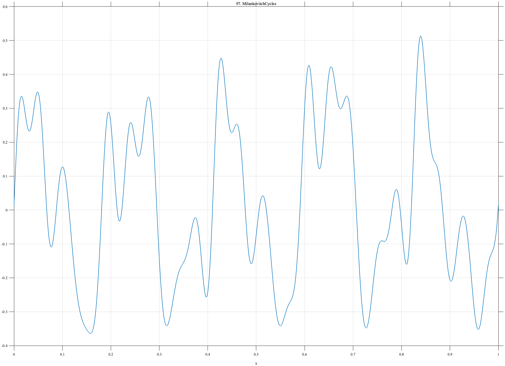

# TF097 — MilankovitchCycles

## Overview

The **MilankovitchCycles** signal combines eccentricity-, obliquity-, and amplitude-modulated precession-like cycles with a finite-duration climatic transition.

## Mathematical Definition

Let $t=500x$ kyr and $s(x;c,w)=[1+e^{-(x-c)/w}]^{-1}$. Define

$$
e(x)=0.25\sin(2\pi t/100+0.2),\qquad
o(x)=0.16\sin(2\pi t/41-0.6),
$$

$$
p(x)=0.10[1+0.55\sin(2\pi t/100+0.7)]\sin(2\pi t/23+0.4).
$$

Then

$$
f(x)=e(x)+o(x)+p(x)+0.18[s(x;0.62,0.008)-s(x;0.71,0.025)].
$$

## Morphological Characteristics

| Property | Description |
|---|---|
| Primary family | Quasiperiodic multiscale cycles plus regime event |
| Analog periods | 100, 41, and 23 kyr |
| Transition | Finite interval near 0.62–0.71 |
| Main challenge | Preserving localized change within persistent quasiperiodicity |

## Parameters

| Parameter | Meaning | Default |
|---|---|---:|
| $500$ | Total time span in kyr | 500 |
| $100,41,23$ | Cycle periods in kyr | As shown |
| $0.18$ | Transition amplitude | 0.18 |

## MATLAB Implementation

~~~matlab
N=1024; x=linspace(0,1,N); s=@(z,c,w) 1./(1+exp(-(z-c)/w));
t=500*x;
ecc=0.25*sin(2*pi*t/100+0.2); obl=0.16*sin(2*pi*t/41-0.6);
precAmp=0.10*(1+0.55*sin(2*pi*t/100+0.7));
prec=precAmp.*sin(2*pi*t/23+0.4);
transition=0.18*(s(x,0.62,0.008)-s(x,0.71,0.025));
f=ecc+obl+prec+transition;
plot(x,f); grid on; title('TF097 — MilankovitchCycles')
exportgraphics(gcf,'TF097_MilankovitchCycles.png','Resolution',300);
~~~

## Python Implementation

~~~python
import numpy as np
import matplotlib.pyplot as plt
N=1024; x=np.linspace(0,1,N); s=lambda c,w: 1/(1+np.exp(-(x-c)/w)); t=500*x
ecc=.25*np.sin(2*np.pi*t/100+.2); obl=.16*np.sin(2*np.pi*t/41-.6)
precAmp=.10*(1+.55*np.sin(2*np.pi*t/100+.7)); prec=precAmp*np.sin(2*np.pi*t/23+.4)
transition=.18*(s(.62,.008)-s(.71,.025)); f=ecc+obl+prec+transition
plt.plot(x,f); plt.grid(alpha=.3); plt.tight_layout()
plt.savefig('TF097_MilankovitchCycles.png',dpi=300)
~~~

## Recommended Uses

- Paleoclimate-series denoising
- Quasiperiodic component preservation
- Local regime-event recovery

## Provenance

**Status:** Milankovitch-cycle-inspired deterministic paleoclimate surrogate.

---

[← Previous: AudioIntro](TF096_AudioIntro.md) | [Category 6 Catalog](index.md) | [Next: TurbiditeSequence →](TF098_TurbiditeSequence.md)
