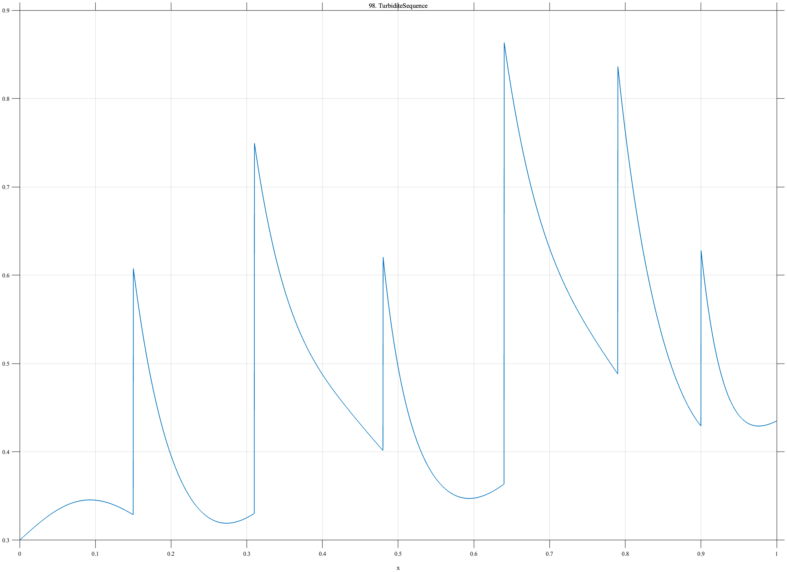

# TF098 — TurbiditeSequence

## Overview

The **TurbiditeSequence** signal contains six sharp depositional onsets with unequal exponential grading scales on a slowly changing background.

## Mathematical Definition

For event centers $c_k$, amplitudes $a_k$, and decay scales $\tau_k$,

$$
f(x)=0.30+0.12x+0.035\sin(6\pi x)+\sum_{k=1}^{6}a_k I(x\ge c_k)e^{-(x-c_k)/\tau_k},
$$

where

$$
c=(0.15,0.31,0.48,0.64,0.79,0.90),
$$

$$
a=(0.28,0.42,0.22,0.50,0.35,0.20),\quad
\tau=(0.045,0.065,0.030,0.075,0.050,0.028).
$$

## Morphological Characteristics

| Property | Description |
|---|---|
| Primary family | Repeated sharp onset and graded decay |
| Events | Six unequal causal deposits |
| Background | Slow trend with weak oscillation |
| Main challenge | Keeping thin events distinct after smoothing |

## Parameters

| Parameter | Meaning | Default |
|---|---|---:|
| $c_k$ | Event locations | As above |
| $a_k$ | Event amplitudes | As above |
| $\tau_k$ | Grading scales | As above |

## MATLAB Implementation

~~~matlab
N=1024; x=linspace(0,1,N);
f=0.30+0.12*x+0.035*sin(2*pi*3*x);
c=[0.15 0.31 0.48 0.64 0.79 0.90]; a=[0.28 0.42 0.22 0.50 0.35 0.20];
tau=[0.045 0.065 0.030 0.075 0.050 0.028];
for k=1:numel(c)
    u=max(x-c(k),0); f=f+a(k)*(x>=c(k)).*exp(-u/tau(k));
end
plot(x,f); grid on; title('TF098 — TurbiditeSequence')
exportgraphics(gcf,'TF098_TurbiditeSequence.png','Resolution',300);
~~~

## Python Implementation

~~~python
import numpy as np
import matplotlib.pyplot as plt
N=1024; x=np.linspace(0,1,N); f=.30+.12*x+.035*np.sin(2*np.pi*3*x)
c=[.15,.31,.48,.64,.79,.90]; a=[.28,.42,.22,.50,.35,.20]
tau=[.045,.065,.030,.075,.050,.028]
for ck,ak,tk in zip(c,a,tau):
    u=np.maximum(x-ck,0); f+=ak*(x>=ck)*np.exp(-u/tk)
plt.plot(x,f); plt.grid(alpha=.3); plt.tight_layout()
plt.savefig('TF098_TurbiditeSequence.png',dpi=300)
~~~

## Recommended Uses

- Stratigraphic-series denoising
- Thin-event preservation
- Causal-decay recovery

## Provenance

**Status:** Turbidite-sequence-inspired deterministic sedimentological surrogate.

---

[← Previous: MilankovitchCycles](TF097_MilankovitchCycles.md) | [Category 6 Catalog](index.md) | [Next: CavefishNeuromast →](TF099_CavefishNeuromast.md)
