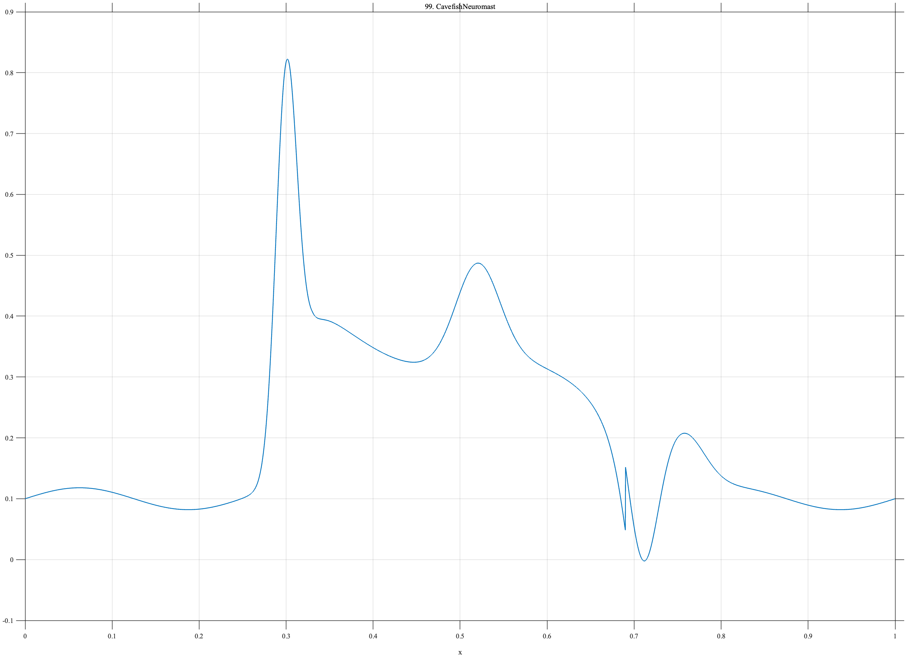

# TF099 — CavefishNeuromast

## Overview

The **CavefishNeuromast** signal combines a rapid sensory onset, sustained stimulation with adaptation, a secondary response, and a biphasic off-response.

## Mathematical Definition

Let $s(x;c,w)=[1+e^{-(x-c)/w}]^{-1}$ and $g(x;c,w)=e^{-((x-c)/w)^2/2}$. Then

$$
\begin{aligned}
f(x)={}&0.10+0.018\sin(8\pi x)+0.62g(x;0.30,0.012)\\
&+0.30[s(x;0.31,0.010)-s(x;0.69,0.018)]\\
&-0.12I(0.33\le x<0.69)[1-e^{-6(x-0.33)}]\\
&+0.16g(x;0.52,0.025)-0.18g(x;0.71,0.016)+0.10g(x;0.755,0.025).
\end{aligned}
$$

## Morphological Characteristics

| Property | Description |
|---|---|
| Primary family | Onset, sustained adaptation, and off-response |
| Stimulation | Approximately 0.31–0.69 |
| Local features | Onset peak, secondary response, negative off peak, rebound |
| Main challenge | Recovering physiologically meaningful changes at several time scales |

## Parameters

| Parameter | Meaning | Default |
|---|---|---:|
| $0.30$ | Onset-response center | 0.30 |
| $6$ | Adaptation rate | 6 |
| $0.71,0.755$ | Off-response centers | As shown |

## MATLAB Implementation

~~~matlab
N=1024; x=linspace(0,1,N); s=@(z,c,w) 1./(1+exp(-(z-c)/w));
base=0.10+0.018*sin(2*pi*4*x);
on=0.62*exp(-0.5*((x-0.30)/0.012).^2);
sustained=0.30*(s(x,0.31,0.010)-s(x,0.69,0.018));
adapt=-0.12*(1-exp(-6*max(x-0.33,0))).*(x>=0.33 & x<0.69);
secondary=0.16*exp(-0.5*((x-0.52)/0.025).^2);
off=-0.18*exp(-0.5*((x-0.71)/0.016).^2)+0.10*exp(-0.5*((x-0.755)/0.025).^2);
f=base+on+sustained+adapt+secondary+off;
plot(x,f); grid on; title('TF099 — CavefishNeuromast')
exportgraphics(gcf,'TF099_CavefishNeuromast.png','Resolution',300);
~~~

## Python Implementation

~~~python
import numpy as np
import matplotlib.pyplot as plt
N=1024; x=np.linspace(0,1,N); s=lambda c,w: 1/(1+np.exp(-(x-c)/w))
g=lambda c,w: np.exp(-.5*((x-c)/w)**2)
base=.10+.018*np.sin(2*np.pi*4*x); on=.62*g(.30,.012)
sustained=.30*(s(.31,.010)-s(.69,.018))
adapt=-.12*(1-np.exp(-6*np.maximum(x-.33,0)))*((x>=.33)&(x<.69))
secondary=.16*g(.52,.025); off=-.18*g(.71,.016)+.10*g(.755,.025)
f=base+on+sustained+adapt+secondary+off
plt.plot(x,f); plt.grid(alpha=.3); plt.tight_layout()
plt.savefig('TF099_CavefishNeuromast.png',dpi=300)
~~~

## Recommended Uses

- Sensory-response denoising
- Adaptation-profile recovery
- On/off transient preservation

## Provenance

**Status:** Cavefish-neuromast-response-inspired deterministic neuroscience surrogate.

---

[← Previous: TurbiditeSequence](TF098_TurbiditeSequence.md) | [Category 6 Catalog](index.md) | [Next: NeuralBurstAdaptation →](TF100_NeuralBurstAdaptation.md)
