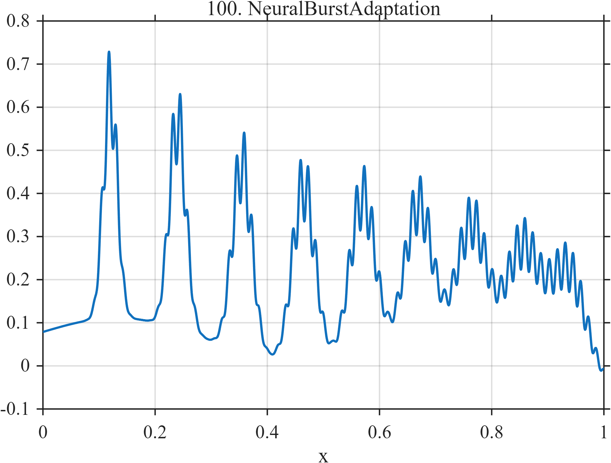

# TF100 — NeuralBurstAdaptation

## Overview

The **NeuralBurstAdaptation** signal contains nine localized, internally oscillatory neural bursts on a slow background. Burst amplitude decreases and width increases through time.

## Mathematical Definition

Let $s(x;c,w)=[1+e^{-(x-c)/w}]^{-1}$,

$$
c=(0.12,0.24,0.355,0.465,0.57,0.67,0.765,0.855,0.935),
$$

$$
a=(0.70,0.64,0.58,0.54,0.49,0.45,0.42,0.39,0.36),\qquad
w_k=0.010+0.0025k.
$$

For $k=1,\ldots,9$, define

$$
g_k(x)=e^{-((x-c_k)/w_k)^2/2},\qquad
o_k(x)=0.60\sin[2\pi(72x+0.8k)].
$$

Then

$$
f(x)=0.08+0.035\sin(2\pi\,1.8x)+\sum_{k=1}^{9}a_k g_k(x)[0.75+0.25o_k(x)]-0.10s(x;0.52,0.12).
$$

## Morphological Characteristics

| Property | Description |
|---|---|
| Primary family | Evolving localized burst train |
| Adaptation | Decreasing amplitude and increasing width |
| Fine structure | High-frequency oscillation within each burst |
| Main challenge | Preserving nonstationary burst morphology across the record |

## Parameters

| Parameter | Meaning | Default |
|---|---|---:|
| $c_k$ | Burst centers | As above |
| $a_k$ | Burst amplitudes | As above |
| $w_k$ | Burst widths | $0.010+0.0025k$ |

## MATLAB Implementation

~~~matlab
N=1024; x=linspace(0,1,N); s=@(z,c,w) 1./(1+exp(-(z-c)/w));
f=0.08+0.035*sin(2*pi*1.8*x);
c=[0.12 0.24 0.355 0.465 0.57 0.67 0.765 0.855 0.935];
a=[0.70 0.64 0.58 0.54 0.49 0.45 0.42 0.39 0.36];
for k=1:numel(c)
    width=0.010+0.0025*k; env=exp(-0.5*((x-c(k))/width).^2);
    localOsc=0.60*sin(2*pi*(72*x+0.8*k));
    f=f+a(k)*env.*(0.75+0.25*localOsc);
end
f=f-0.10*s(x,0.52,0.12);
plot(x,f); grid on; title('TF100 — NeuralBurstAdaptation')
exportgraphics(gcf,'TF100_NeuralBurstAdaptation.png','Resolution',300);
~~~

## Python Implementation

~~~python
import numpy as np
import matplotlib.pyplot as plt
N=1024; x=np.linspace(0,1,N); s=lambda c,w: 1/(1+np.exp(-(x-c)/w))
f=.08+.035*np.sin(2*np.pi*1.8*x)
c=[.12,.24,.355,.465,.57,.67,.765,.855,.935]
a=[.70,.64,.58,.54,.49,.45,.42,.39,.36]
for k,(ck,ak) in enumerate(zip(c,a),start=1):
    width=.010+.0025*k; env=np.exp(-.5*((x-ck)/width)**2)
    localOsc=.60*np.sin(2*np.pi*(72*x+.8*k)); f+=ak*env*(.75+.25*localOsc)
f-=.10*s(.52,.12)
plt.plot(x,f); plt.grid(alpha=.3); plt.tight_layout()
plt.savefig('TF100_NeuralBurstAdaptation.png',dpi=300)
~~~

## Recommended Uses

- Adaptive-burst denoising
- Evolving-width feature preservation
- Neural time-series benchmarking

## Provenance

**Status:** Adaptive-neural-burst-inspired deterministic surrogate.

---

[← Previous: CavefishNeuromast](TF099_CavefishNeuromast.md) | [Category 6 Catalog](index.md) | Next: end of Category 6
