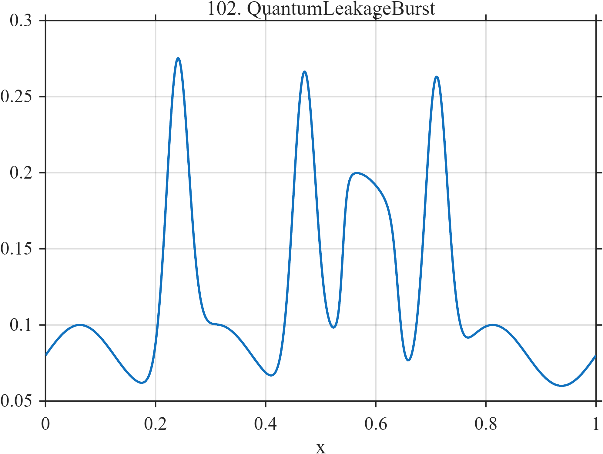

# TF102 — QuantumLeakageBurst

## Overview

The **QuantumLeakageBurst** signal combines a nearly stable low-amplitude readout, three leakage-like excursions, and a finite-duration level shift.

## Mathematical Definition

Let $S(x;c,w)=[1+e^{-(x-c)/w}]^{-1}$ and $g(x;c,w)=e^{-((x-c)/w)^2/2}$. Then

$$
\begin{aligned}
f(x)={}&0.08+0.02\sin(8\pi x)
+0.20\sum_{c\in\{0.24,0.47,0.71\}}g(x;c,0.020)\\
&+0.10[S(x;0.54,0.004)-S(x;0.64,0.006)].
\end{aligned}
$$

## Morphological Characteristics

| Property | Description |
|---|---|
| Primary family | Sparse excursions plus finite level shift |
| Leakage events | Near 0.24, 0.47, and 0.71 |
| Shift interval | Approximately 0.54–0.64 |
| Main challenge | Preserving small transients in a low-amplitude background |

## Parameters

| Parameter | Meaning | Default |
|---|---|---:|
| $0.20$ | Leakage-burst amplitude | 0.20 |
| $0.020$ | Leakage-burst width | 0.020 |
| $0.10$ | Level-shift amplitude | 0.10 |

## MATLAB Implementation

~~~matlab
N=1024; x=linspace(0,1,N); S=@(z,c,w) 1./(1+exp(-(z-c)/w));
f=0.08+0.02*sin(2*pi*4*x);
for c=[0.24 0.47 0.71]
    f=f+0.20*exp(-0.5*((x-c)/0.020).^2);
end
f=f+0.10*(S(x,0.54,0.004)-S(x,0.64,0.006));
plot(x,f); grid on; title('TF102 — QuantumLeakageBurst')
exportgraphics(gcf,'TF102_QuantumLeakageBurst.png','Resolution',300);
~~~

## Python Implementation

~~~python
import numpy as np
import matplotlib.pyplot as plt
N=1024; x=np.linspace(0,1,N); S=lambda c,w: 1/(1+np.exp(-(x-c)/w))
f=.08+.02*np.sin(2*np.pi*4*x)
for c in [.24,.47,.71]: f+=.20*np.exp(-.5*((x-c)/.020)**2)
f+=.10*(S(.54,.004)-S(.64,.006))
plt.plot(x,f); plt.grid(alpha=.3); plt.tight_layout()
plt.savefig('TF102_QuantumLeakageBurst.png',dpi=300)
~~~

## Recommended Uses

- Quantum-readout denoising
- Small-excursion recovery
- Short state-change preservation

## Provenance

**Status:** Quantum-leakage-monitoring-inspired deterministic surrogate.

---

[← Previous: QuantumRamseyDrift](TF101_QuantumRamseyDrift.md) | [Category 7 Catalog](index.md) | [Next: FusionELMSawtooth →](TF103_FusionELMSawtooth.md)
