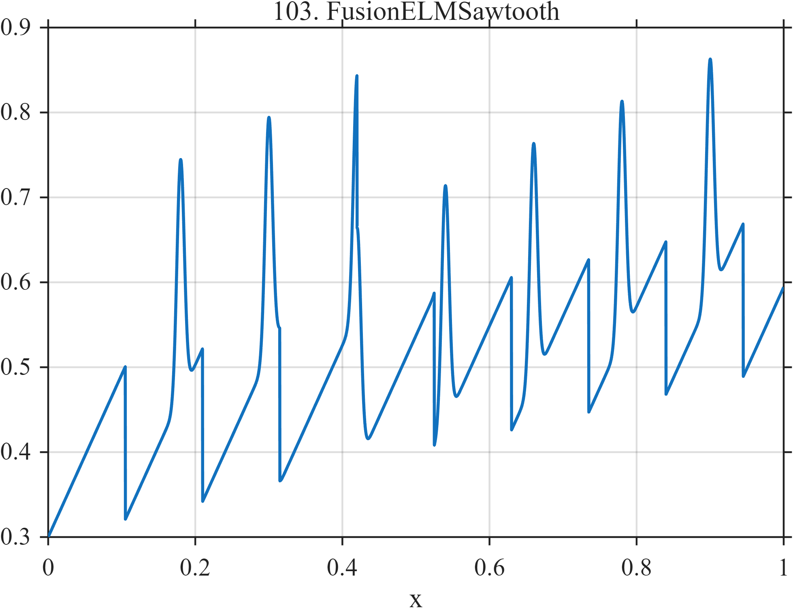

# TF103 — FusionELMSawtooth

## Overview

The **FusionELMSawtooth** signal places repeated sawtooth ramps and seven narrow ELM-like bursts on a rising plasma-like baseline.

## Mathematical Definition

Let $p=0.105$, $r(x)=(x\bmod p)/p$, $g(x;c,w)=e^{-((x-c)/w)^2/2}$, and

$$
\mathcal C=(0.18,0.30,0.42,0.54,0.66,0.78,0.90).
$$

Then

$$
f(x)=0.30+0.20x+0.18r(x)+0.28\sum_{c\in\mathcal C}g(x;c,0.005).
$$

## Morphological Characteristics

| Property | Description |
|---|---|
| Primary family | Repetitive ramps with narrow energetic bursts |
| Sawtooth period | 0.105 |
| Burst width | 0.005 |
| Main challenge | Preserving narrow events without distorting repeated ramps |

## Parameters

| Parameter | Meaning | Default |
|---|---|---:|
| $p$ | Sawtooth period | 0.105 |
| $0.18$ | Sawtooth amplitude | 0.18 |
| $0.28$ | ELM-like burst amplitude | 0.28 |

## MATLAB Implementation

~~~matlab
N=1024; x=linspace(0,1,N);
f=0.30+0.20*x; period=0.105; phase=mod(x,period)/period;
f=f+0.18*phase;
for c=0.18:0.12:0.90
    f=f+0.28*exp(-0.5*((x-c)/0.005).^2);
end
plot(x,f); grid on; title('TF103 — FusionELMSawtooth')
exportgraphics(gcf,'TF103_FusionELMSawtooth.png','Resolution',300);
~~~

## Python Implementation

~~~python
import numpy as np
import matplotlib.pyplot as plt
N=1024; x=np.linspace(0,1,N); period=.105
f=.30+.20*x+.18*(np.mod(x,period)/period)
for c in np.arange(.18,.901,.12): f+=.28*np.exp(-.5*((x-c)/.005)**2)
plt.plot(x,f); plt.grid(alpha=.3); plt.tight_layout()
plt.savefig('TF103_FusionELMSawtooth.png',dpi=300)
~~~

## Recommended Uses

- Fusion-diagnostic denoising
- Sawtooth preservation
- Narrow-burst recovery

## Provenance

**Status:** Fusion-plasma-morphology-inspired deterministic surrogate.

---

[← Previous: QuantumLeakageBurst](TF102_QuantumLeakageBurst.md) | [Category 7 Catalog](index.md) | [Next: TokamakDisruption →](TF104_TokamakDisruption.md)
