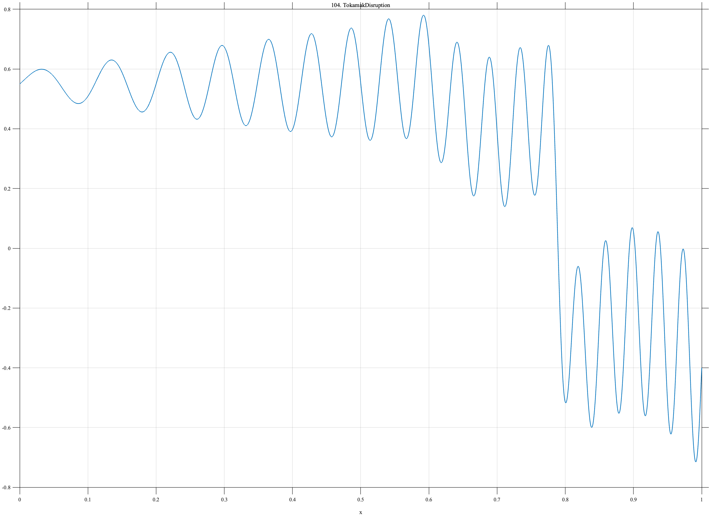

# TF104 — TokamakDisruption

## Overview

The **TokamakDisruption** signal contains a growing chirped oscillation, a slower locking-like component that emerges before failure, and an abrupt disruption collapse.

## Mathematical Definition

Let $S(x;c,w)=[1+e^{-(x-c)/w}]^{-1}$. Then

$$
\begin{aligned}
f(x)={}&0.55+(0.04+0.30x)\sin[2\pi(8x+10x^2)]\\
&+0.16\sin(5\pi x)S(x;0.58,0.02)-0.95S(x;0.79,0.006).
\end{aligned}
$$

## Morphological Characteristics

| Property | Description |
|---|---|
| Primary family | Growing precursor and abrupt collapse |
| Locking component | Emerges near $x=0.58$ |
| Disruption | Sharp negative transition near $x=0.79$ |
| Main challenge | Retaining weak precursor structure before the dominant event |

## Parameters

| Parameter | Meaning | Default |
|---|---|---:|
| $0.30$ | Oscillation-amplitude growth coefficient | 0.30 |
| $0.58$ | Locking-component onset | 0.58 |
| $-0.95$ | Collapse magnitude | -0.95 |

## MATLAB Implementation

~~~matlab
N=1024; x=linspace(0,1,N); S=@(z,c,w) 1./(1+exp(-(z-c)/w));
grow=(0.04+0.30*x).*sin(2*pi*(8*x+10*x.^2));
locking=0.16*sin(2*pi*2.5*x).*S(x,0.58,0.02);
collapse=-0.95*S(x,0.79,0.006);
f=0.55+grow+locking+collapse;
plot(x,f); grid on; title('TF104 — TokamakDisruption')
exportgraphics(gcf,'TF104_TokamakDisruption.png','Resolution',300);
~~~

## Python Implementation

~~~python
import numpy as np
import matplotlib.pyplot as plt
N=1024; x=np.linspace(0,1,N); S=lambda c,w: 1/(1+np.exp(-(x-c)/w))
grow=(.04+.30*x)*np.sin(2*np.pi*(8*x+10*x**2))
locking=.16*np.sin(2*np.pi*2.5*x)*S(.58,.02); collapse=-.95*S(.79,.006)
f=.55+grow+locking+collapse
plt.plot(x,f); plt.grid(alpha=.3); plt.tight_layout()
plt.savefig('TF104_TokamakDisruption.png',dpi=300)
~~~

## Recommended Uses

- Precursor-preserving denoising
- Abrupt-collapse localization
- Nonstationary oscillation recovery

## Provenance

**Status:** Tokamak-disruption-inspired deterministic fusion surrogate.

---

[← Previous: FusionELMSawtooth](TF103_FusionELMSawtooth.md) | [Category 7 Catalog](index.md) | [Next: CalciumTransientTrain →](TF105_CalciumTransientTrain.md)
