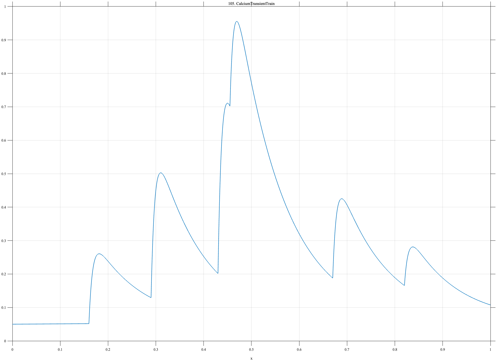

# TF105 — CalciumTransientTrain

## Overview

The **CalciumTransientTrain** signal contains six causal fast-rise, slow-decay responses. Two nearby events overlap, and the final small event is intentionally difficult to preserve.

## Mathematical Definition

For event centers $c_k$ and amplitudes $a_k$, let $u_k=(x-c_k)_+$. Then

$$
f(x)=0.05+0.01x+\sum_{k=1}^{6}a_k I(x\ge c_k)[1-e^{-120u_k}]e^{-10u_k},
$$

where

$$
c=(0.16,0.29,0.43,0.455,0.67,0.82),\qquad
a=(0.28,0.52,0.72,0.45,0.35,0.18).
$$

## Morphological Characteristics

| Property | Description |
|---|---|
| Primary family | Sparse overlapping asymmetric transients |
| Rise and decay | Rapid rise and slower decay |
| Close pair | Events at 0.43 and 0.455 |
| Main challenge | Resolving overlap while preserving the weak event at 0.82 |

## Parameters

| Parameter | Meaning | Default |
|---|---|---:|
| $120$ | Rise rate | 120 |
| $10$ | Decay rate | 10 |
| $c_k,a_k$ | Event centers and amplitudes | As above |

## MATLAB Implementation

~~~matlab
N=1024; x=linspace(0,1,N); f=0.05+0.01*x;
c=[0.16 0.29 0.43 0.455 0.67 0.82]; a=[0.28 0.52 0.72 0.45 0.35 0.18];
for k=1:numel(c)
    u=max(x-c(k),0);
    f=f+a(k)*(x>=c(k)).*(1-exp(-120*u)).*exp(-10*u);
end
plot(x,f); grid on; title('TF105 — CalciumTransientTrain')
exportgraphics(gcf,'TF105_CalciumTransientTrain.png','Resolution',300);
~~~

## Python Implementation

~~~python
import numpy as np
import matplotlib.pyplot as plt
N=1024; x=np.linspace(0,1,N); f=.05+.01*x
c=[.16,.29,.43,.455,.67,.82]; a=[.28,.52,.72,.45,.35,.18]
for ck,ak in zip(c,a):
    u=np.maximum(x-ck,0); f+=ak*(x>=ck)*(1-np.exp(-120*u))*np.exp(-10*u)
plt.plot(x,f); plt.grid(alpha=.3); plt.tight_layout()
plt.savefig('TF105_CalciumTransientTrain.png',dpi=300)
~~~

## Recommended Uses

- Calcium-imaging trace denoising
- Overlapping-transient resolution
- Weak-event preservation

## Provenance

**Status:** Calcium-transient-inspired deterministic neural-imaging surrogate.

---

[← Previous: TokamakDisruption](TF104_TokamakDisruption.md) | [Category 7 Catalog](index.md) | [Next: NanoporeCurrent →](TF106_NanoporeCurrent.md)
