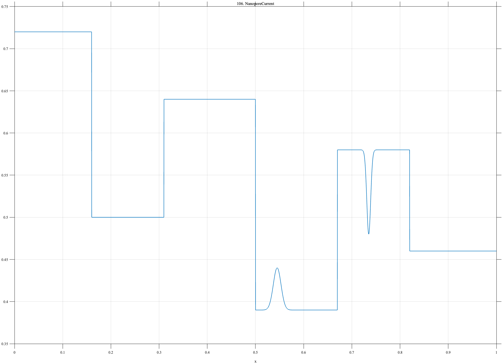

# TF106 — NanoporeCurrent

## Overview

The **NanoporeCurrent** signal consists of six unequal current levels with different dwell times, plus a brief positive secondary state and a very narrow blockage.

## Mathematical Definition

Let

$$
b=(0,0.16,0.31,0.50,0.67,0.82,1),\qquad
\ell=(0.72,0.50,0.64,0.39,0.58,0.46).
$$

Define $L(x)=\ell_k$ for $b_k\le x<b_{k+1}$, using $L(1)=\ell_6$. Then

$$
f(x)=L(x)+0.05e^{-((x-0.545)/0.008)^2/2}-0.10e^{-((x-0.735)/0.004)^2/2}.
$$

## Morphological Characteristics

| Property | Description |
|---|---|
| Primary family | Piecewise levels with brief local states |
| Dwell structure | Six unequal intervals |
| Shortest feature | Negative blockage near $x=0.735$ |
| Main challenge | Segmenting steps without erasing very short states |

## Parameters

| Parameter | Meaning | Default |
|---|---|---:|
| $b_k$ | Level boundaries | As above |
| $\ell_k$ | Current levels | As above |
| $0.004$ | Blockage width | 0.004 |

## MATLAB Implementation

~~~matlab
N=1024; x=linspace(0,1,N);
levels=[0.72 0.50 0.64 0.39 0.58 0.46]; edges=[0 0.16 0.31 0.50 0.67 0.82 1];
f=zeros(size(x));
for k=1:numel(levels)
    idx=x>=edges(k) & x<edges(k+1); f(idx)=levels(k);
end
f(x>=edges(end-1))=levels(end);
f=f+0.05*exp(-0.5*((x-0.545)/0.008).^2)-0.10*exp(-0.5*((x-0.735)/0.004).^2);
plot(x,f); grid on; title('TF106 — NanoporeCurrent')
exportgraphics(gcf,'TF106_NanoporeCurrent.png','Resolution',300);
~~~

## Python Implementation

~~~python
import numpy as np
import matplotlib.pyplot as plt
N=1024; x=np.linspace(0,1,N)
levels=[.72,.50,.64,.39,.58,.46]; edges=[0,.16,.31,.50,.67,.82,1]
f=np.zeros_like(x)
for k,level in enumerate(levels): f[(x>=edges[k])&(x<edges[k+1])]=level
f[x>=edges[-2]]=levels[-1]
f+=.05*np.exp(-.5*((x-.545)/.008)**2)-.10*np.exp(-.5*((x-.735)/.004)**2)
plt.plot(x,f); plt.grid(alpha=.3); plt.tight_layout()
plt.savefig('TF106_NanoporeCurrent.png',dpi=300)
~~~

## Recommended Uses

- Nanopore-current denoising
- Piecewise-level segmentation
- Brief-state preservation

## Provenance

**Status:** Nanopore-current-inspired deterministic genomics surrogate.

---

[← Previous: CalciumTransientTrain](TF105_CalciumTransientTrain.md) | [Category 7 Catalog](index.md) | [Next: CopyNumberGenome →](TF107_CopyNumberGenome.md)
