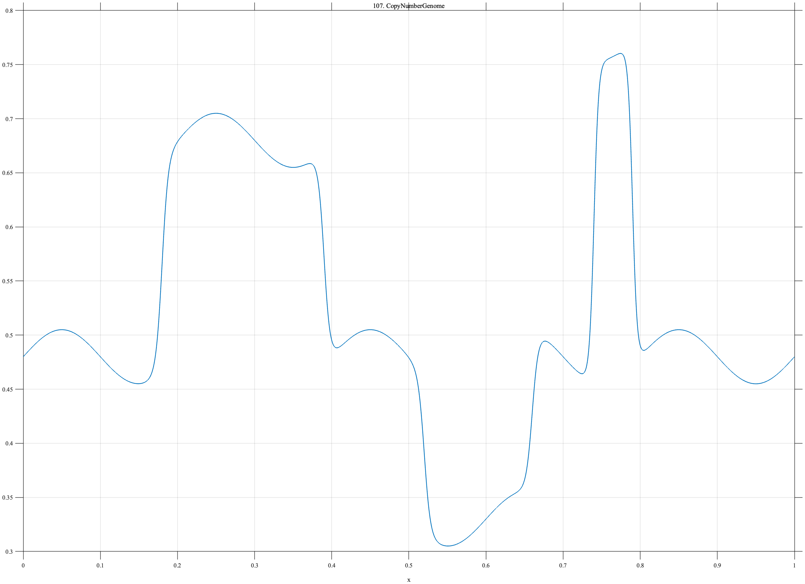

# TF107 — CopyNumberGenome

## Overview

The **CopyNumberGenome** signal contains long genomic segments, a deletion, a narrow focal amplification, and mild smooth waviness.

## Mathematical Definition

Let $S(x;c,w)=[1+e^{-(x-c)/w}]^{-1}$. Then

$$
\begin{aligned}
f(x)={}&0.48+0.025\sin(10\pi x)\\
&+0.20[S(x;0.18,0.004)-S(x;0.39,0.004)]\\
&-0.15[S(x;0.52,0.004)-S(x;0.66,0.004)]\\
&+0.30[S(x;0.74,0.003)-S(x;0.79,0.003)].
\end{aligned}
$$

## Morphological Characteristics

| Property | Description |
|---|---|
| Primary family | Multiscale piecewise-constant structure |
| Broad alterations | Gain from 0.18–0.39 and deletion from 0.52–0.66 |
| Focal feature | Amplification from 0.74–0.79 |
| Main challenge | Preserving a narrow genomic segment alongside long segments |

## Parameters

| Parameter | Meaning | Default |
|---|---|---:|
| $0.20$ | Broad gain magnitude | 0.20 |
| $-0.15$ | Deletion magnitude | -0.15 |
| $0.30$ | Focal amplification magnitude | 0.30 |

## MATLAB Implementation

~~~matlab
N=1024; x=linspace(0,1,N); S=@(z,c,w) 1./(1+exp(-(z-c)/w));
f=0.48+0.025*sin(2*pi*5*x);
f=f+0.20*(S(x,0.18,0.004)-S(x,0.39,0.004)) ...
    -0.15*(S(x,0.52,0.004)-S(x,0.66,0.004)) ...
    +0.30*(S(x,0.74,0.003)-S(x,0.79,0.003));
plot(x,f); grid on; title('TF107 — CopyNumberGenome')
exportgraphics(gcf,'TF107_CopyNumberGenome.png','Resolution',300);
~~~

## Python Implementation

~~~python
import numpy as np
import matplotlib.pyplot as plt
N=1024; x=np.linspace(0,1,N); S=lambda c,w: 1/(1+np.exp(-(x-c)/w))
f=.48+.025*np.sin(2*np.pi*5*x)
f+=.20*(S(.18,.004)-S(.39,.004))-.15*(S(.52,.004)-S(.66,.004))
f+=.30*(S(.74,.003)-S(.79,.003))
plt.plot(x,f); plt.grid(alpha=.3); plt.tight_layout()
plt.savefig('TF107_CopyNumberGenome.png',dpi=300)
~~~

## Recommended Uses

- Copy-number denoising
- Segment-boundary preservation
- Focal-amplification detection

## Provenance

**Status:** Genomic-copy-number-inspired deterministic surrogate.

---

[← Previous: NanoporeCurrent](TF106_NanoporeCurrent.md) | [Category 7 Catalog](index.md) | [Next: SpatialTranscriptScan →](TF108_SpatialTranscriptScan.md)
