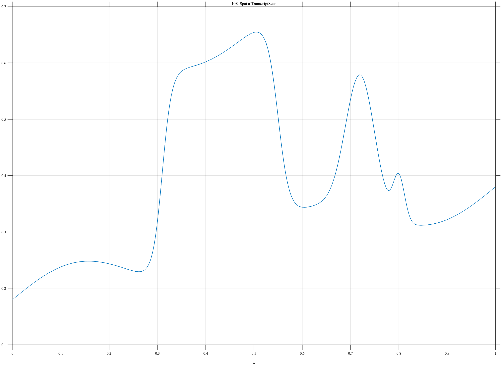

# TF108 — SpatialTranscriptScan

## Overview

The **SpatialTranscriptScan** signal places a strong tissue-domain interval, a localized hotspot, and a much smaller neighboring domain on a smooth spatial trend.

## Mathematical Definition

Let $S(x;c,w)=[1+e^{-(x-c)/w}]^{-1}$ and $g(x;c,w)=e^{-((x-c)/w)^2/2}$. Then

$$
\begin{aligned}
f(x)={}&0.18+0.20x+0.04\sin(4\pi x)\\
&+0.38[S(x;0.31,0.010)-S(x;0.55,0.012)]\\
&+0.24g(x;0.72,0.030)+0.08g(x;0.80,0.012).
\end{aligned}
$$

## Morphological Characteristics

| Property | Description |
|---|---|
| Primary family | Spatial trend, domain, hotspot, and weak feature |
| Strong domain | Approximately 0.31–0.55 |
| Weak domain | Narrow peak near $x=0.80$ |
| Main challenge | Retaining a weak neighboring feature without roughening the trend |

## Parameters

| Parameter | Meaning | Default |
|---|---|---:|
| $0.38$ | Tissue-domain amplitude | 0.38 |
| $0.24$ | Hotspot amplitude | 0.24 |
| $0.08$ | Weak-domain amplitude | 0.08 |

## MATLAB Implementation

~~~matlab
N=1024; x=linspace(0,1,N); S=@(z,c,w) 1./(1+exp(-(z-c)/w));
f=0.18+0.20*x+0.04*sin(2*pi*2*x);
f=f+0.38*(S(x,0.31,0.010)-S(x,0.55,0.012)) ...
    +0.24*exp(-0.5*((x-0.72)/0.030).^2) ...
    +0.08*exp(-0.5*((x-0.80)/0.012).^2);
plot(x,f); grid on; title('TF108 — SpatialTranscriptScan')
exportgraphics(gcf,'TF108_SpatialTranscriptScan.png','Resolution',300);
~~~

## Python Implementation

~~~python
import numpy as np
import matplotlib.pyplot as plt
N=1024; x=np.linspace(0,1,N); S=lambda c,w: 1/(1+np.exp(-(x-c)/w))
g=lambda c,w: np.exp(-.5*((x-c)/w)**2)
f=.18+.20*x+.04*np.sin(2*np.pi*2*x)
f+=.38*(S(.31,.010)-S(.55,.012))+.24*g(.72,.030)+.08*g(.80,.012)
plt.plot(x,f); plt.grid(alpha=.3); plt.tight_layout()
plt.savefig('TF108_SpatialTranscriptScan.png',dpi=300)
~~~

## Recommended Uses

- Spatial-omics smoothing
- Domain-boundary recovery
- Weak-hotspot preservation

## Provenance

**Status:** Spatial-transcriptomics-inspired deterministic surrogate.

---

[← Previous: CopyNumberGenome](TF107_CopyNumberGenome.md) | [Category 7 Catalog](index.md) | [Next: SemiconductorMetrology →](TF109_SemiconductorMetrology.md)
