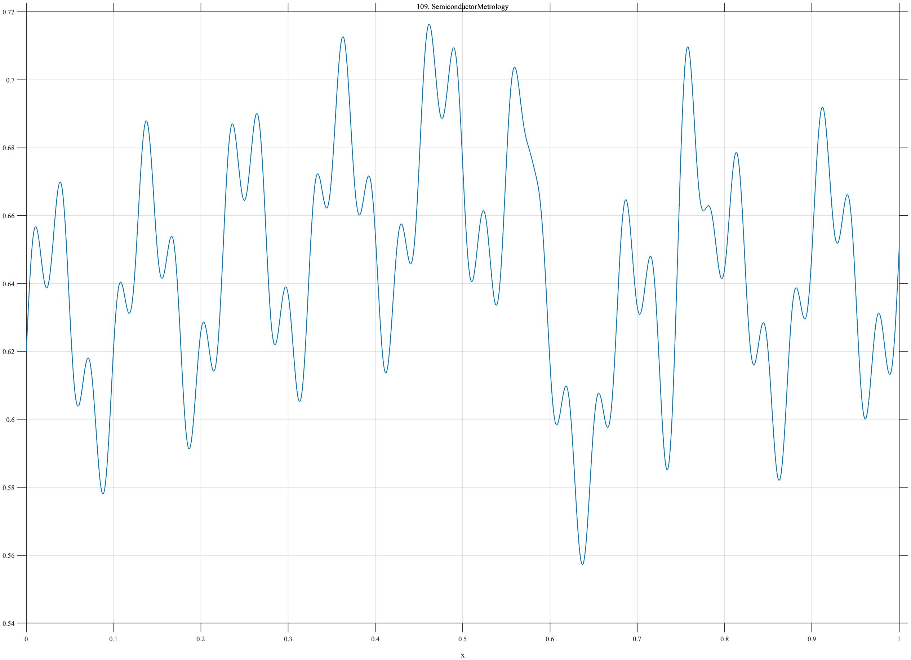

# TF109 — SemiconductorMetrology

## Overview

The **SemiconductorMetrology** signal combines slow critical-dimension-like drift, periodic tool variation at two scales, a sharp recalibration shift, and a localized defect excursion.

## Mathematical Definition

Let $S(x;c,w)=[1+e^{-(x-c)/w}]^{-1}$ and $g(x;c,w)=e^{-((x-c)/w)^2/2}$. Then

$$
f(x)=0.62+0.11x+0.035\sin(18\pi x)+0.018\sin(62\pi x)-0.08S(x;0.58,0.004)+0.12g(x;0.76,0.010).
$$

## Morphological Characteristics

| Property | Description |
|---|---|
| Primary family | Drift, periodic variation, step, and local defect |
| Recalibration | Negative shift near $x=0.58$ |
| Defect excursion | Narrow positive peak near $x=0.76$ |
| Main challenge | Separating tool periodicity from true process changes |

## Parameters

| Parameter | Meaning | Default |
|---|---|---:|
| $9,31$ | Periodic cycle counts | As shown |
| $-0.08$ | Recalibration magnitude | -0.08 |
| $0.010$ | Defect width | 0.010 |

## MATLAB Implementation

~~~matlab
N=1024; x=linspace(0,1,N); S=@(z,c,w) 1./(1+exp(-(z-c)/w));
f=0.62+0.11*x+0.035*sin(2*pi*9*x)+0.018*sin(2*pi*31*x);
f=f-0.08*S(x,0.58,0.004)+0.12*exp(-0.5*((x-0.76)/0.010).^2);
plot(x,f); grid on; title('TF109 — SemiconductorMetrology')
exportgraphics(gcf,'TF109_SemiconductorMetrology.png','Resolution',300);
~~~

## Python Implementation

~~~python
import numpy as np
import matplotlib.pyplot as plt
N=1024; x=np.linspace(0,1,N); S=lambda c,w: 1/(1+np.exp(-(x-c)/w))
f=.62+.11*x+.035*np.sin(2*np.pi*9*x)+.018*np.sin(2*np.pi*31*x)
f+=-.08*S(.58,.004)+.12*np.exp(-.5*((x-.76)/.010)**2)
plt.plot(x,f); plt.grid(alpha=.3); plt.tight_layout()
plt.savefig('TF109_SemiconductorMetrology.png',dpi=300)
~~~

## Recommended Uses

- Manufacturing-process smoothing
- Recalibration-step detection
- Local-defect preservation

## Provenance

**Status:** Semiconductor-metrology-inspired deterministic surrogate.

---

[← Previous: SpatialTranscriptScan](TF108_SpatialTranscriptScan.md) | [Category 7 Catalog](index.md) | [Next: LithographyEdge →](TF110_LithographyEdge.md)
