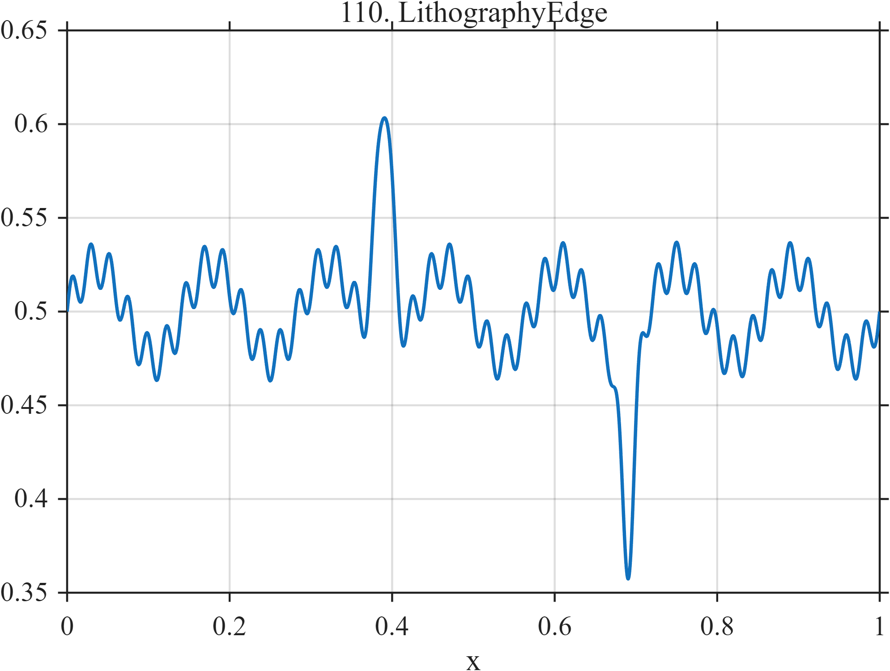

# TF110 — LithographyEdge

## Overview

The **LithographyEdge** signal represents a nominal edge with low- and high-frequency roughness plus localized positive and negative bridge/pinch-like defects.

## Mathematical Definition

Let $g(x;c,w)=e^{-((x-c)/w)^2/2}$. Then

$$
f(x)=0.50+0.025\sin(14\pi x)+0.012\sin(86\pi x)+0.14g(x;0.39,0.010)-0.11g(x;0.69,0.008).
$$

## Morphological Characteristics

| Property | Description |
|---|---|
| Primary family | Multiscale roughness with localized defects |
| Roughness scales | 7 and 43 cycles |
| Defects | Positive near 0.39 and negative near 0.69 |
| Main challenge | Preserving small geometry defects within structured roughness |

## Parameters

| Parameter | Meaning | Default |
|---|---|---:|
| $0.025,0.012$ | Roughness amplitudes | As shown |
| $0.14,-0.11$ | Defect amplitudes | As shown |

## MATLAB Implementation

~~~matlab
N=1024; x=linspace(0,1,N);
f=0.50+0.025*sin(2*pi*7*x)+0.012*sin(2*pi*43*x);
f=f+0.14*exp(-0.5*((x-0.39)/0.010).^2)-0.11*exp(-0.5*((x-0.69)/0.008).^2);
plot(x,f); grid on; title('TF110 — LithographyEdge')
exportgraphics(gcf,'TF110_LithographyEdge.png','Resolution',300);
~~~

## Python Implementation

~~~python
import numpy as np
import matplotlib.pyplot as plt
N=1024; x=np.linspace(0,1,N)
f=.50+.025*np.sin(2*np.pi*7*x)+.012*np.sin(2*np.pi*43*x)
f+=.14*np.exp(-.5*((x-.39)/.010)**2)-.11*np.exp(-.5*((x-.69)/.008)**2)
plt.plot(x,f); plt.grid(alpha=.3); plt.tight_layout()
plt.savefig('TF110_LithographyEdge.png',dpi=300)
~~~

## Recommended Uses

- Edge-profile smoothing
- Multiscale roughness preservation
- Bridge/pinch defect detection

## Provenance

**Status:** Lithographic-edge-metrology-inspired deterministic surrogate.

---

[← Previous: SemiconductorMetrology](TF109_SemiconductorMetrology.md) | [Category 7 Catalog](index.md) | [Next: ParticlePileup →](TF111_ParticlePileup.md)
