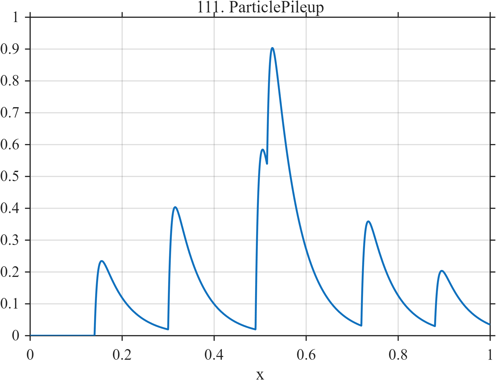

# TF111 — ParticlePileup

## Overview

The **ParticlePileup** signal contains six detector-like pulses with fast rise and slower decay. The events at 0.49 and 0.515 deliberately create a pulse-pile-up resolution problem.

## Mathematical Definition

For pulse centers $c_k$ and amplitudes $a_k$, let $u_k=(x-c_k)_+$. Then

$$
f(x)=\sum_{k=1}^{6}a_k I(x\ge c_k)[1-e^{-140u_k}]e^{-18u_k},
$$

where

$$
c=(0.14,0.30,0.49,0.515,0.72,0.88),\qquad
a=(0.35,0.58,0.85,0.70,0.50,0.27).
$$

## Morphological Characteristics

| Property | Description |
|---|---|
| Primary family | Overlapping asymmetric detector pulses |
| Rise and decay | Fast rise, slower decay |
| Pile-up pair | Centers at 0.49 and 0.515 |
| Main challenge | Resolving close arrivals without splitting isolated pulses |

## Parameters

| Parameter | Meaning | Default |
|---|---|---:|
| $140$ | Pulse rise rate | 140 |
| $18$ | Pulse decay rate | 18 |
| $c_k,a_k$ | Arrival times and amplitudes | As above |

## MATLAB Implementation

~~~matlab
N=1024; x=linspace(0,1,N); f=zeros(size(x));
c=[0.14 0.30 0.49 0.515 0.72 0.88]; a=[0.35 0.58 0.85 0.70 0.50 0.27];
for k=1:numel(c)
    u=max(x-c(k),0);
    f=f+a(k)*(x>=c(k)).*(1-exp(-140*u)).*exp(-18*u);
end
plot(x,f); grid on; title('TF111 — ParticlePileup')
exportgraphics(gcf,'TF111_ParticlePileup.png','Resolution',300);
~~~

## Python Implementation

~~~python
import numpy as np
import matplotlib.pyplot as plt
N=1024; x=np.linspace(0,1,N); f=np.zeros_like(x)
c=[.14,.30,.49,.515,.72,.88]; a=[.35,.58,.85,.70,.50,.27]
for ck,ak in zip(c,a):
    u=np.maximum(x-ck,0); f+=ak*(x>=ck)*(1-np.exp(-140*u))*np.exp(-18*u)
plt.plot(x,f); plt.grid(alpha=.3); plt.tight_layout()
plt.savefig('TF111_ParticlePileup.png',dpi=300)
~~~

## Recommended Uses

- Detector-pulse denoising
- Pulse-pile-up resolution
- Unequal-event preservation

## Provenance

**Status:** High-energy-detector-pulse-inspired deterministic surrogate.

---

[← Previous: LithographyEdge](TF110_LithographyEdge.md) | [Category 7 Catalog](index.md) | [Next: CryogenicPulse →](TF112_CryogenicPulse.md)
