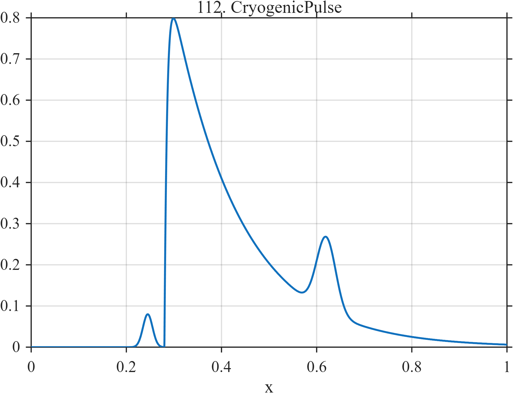

# TF112 — CryogenicPulse

## Overview

The **CryogenicPulse** signal combines a weak precursor, a sharp thermal-pulse onset with long decay, and a smaller delayed secondary pulse.

## Mathematical Definition

Let $u=(x-0.28)_+$ and $g(x;c,w)=e^{-((x-c)/w)^2/2}$. Then

$$
f(x)=0.95I(x\ge0.28)[1-e^{-170u}]e^{-7u}+0.08g(x;0.245,0.010)+0.18g(x;0.62,0.020).
$$

## Morphological Characteristics

| Property | Description |
|---|---|
| Primary family | Precursor, sharp onset, long decay, and secondary pulse |
| Main onset | $x=0.28$ |
| Weak structures | Precursor at 0.245 and secondary pulse at 0.62 |
| Main challenge | Preserving three components at substantially different scales |

## Parameters

| Parameter | Meaning | Default |
|---|---|---:|
| $170$ | Main-pulse rise rate | 170 |
| $7$ | Main-pulse decay rate | 7 |
| $0.08,0.18$ | Auxiliary pulse amplitudes | As shown |

## MATLAB Implementation

~~~matlab
N=1024; x=linspace(0,1,N); u=max(x-0.28,0);
main=0.95*(x>=0.28).*(1-exp(-170*u)).*exp(-7*u);
precursor=0.08*exp(-0.5*((x-0.245)/0.010).^2);
secondary=0.18*exp(-0.5*((x-0.62)/0.020).^2);
f=main+precursor+secondary;
plot(x,f); grid on; title('TF112 — CryogenicPulse')
exportgraphics(gcf,'TF112_CryogenicPulse.png','Resolution',300);
~~~

## Python Implementation

~~~python
import numpy as np
import matplotlib.pyplot as plt
N=1024; x=np.linspace(0,1,N); u=np.maximum(x-.28,0)
main=.95*(x>=.28)*(1-np.exp(-170*u))*np.exp(-7*u)
precursor=.08*np.exp(-.5*((x-.245)/.010)**2)
secondary=.18*np.exp(-.5*((x-.62)/.020)**2); f=main+precursor+secondary
plt.plot(x,f); plt.grid(alpha=.3); plt.tight_layout()
plt.savefig('TF112_CryogenicPulse.png',dpi=300)
~~~

## Recommended Uses

- Cryogenic-detector denoising
- Weak-precursor recovery
- Long-tail preservation

## Provenance

**Status:** Cryogenic-detector-pulse-inspired deterministic surrogate.

---

[← Previous: ParticlePileup](TF111_ParticlePileup.md) | [Category 7 Catalog](index.md) | [Next: SpaceWeatherStorm →](TF113_SpaceWeatherStorm.md)
