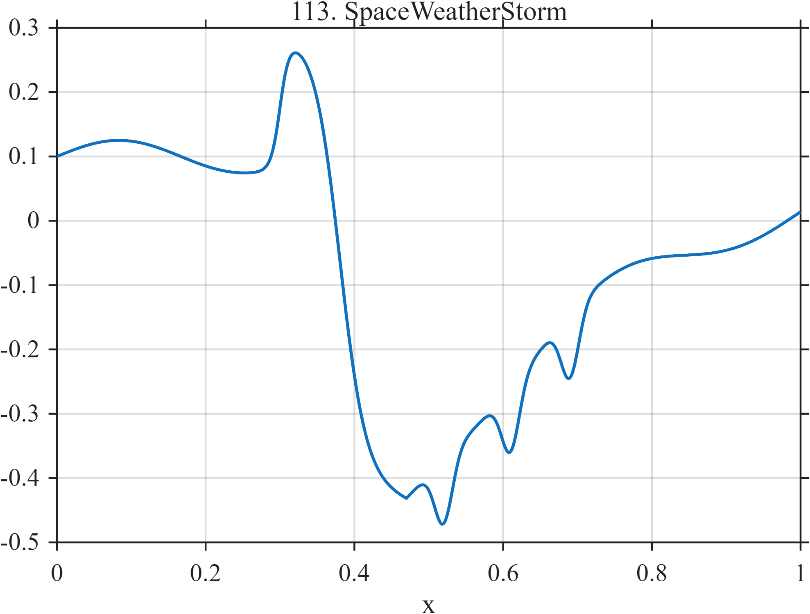

# TF113 — SpaceWeatherStorm

## Overview

The **SpaceWeatherStorm** signal has a quiet periodic background, sudden commencement, deep storm depression, three substorm-like excursions, and prolonged recovery.

## Mathematical Definition

Let $S(x;c,w)=[1+e^{-(x-c)/w}]^{-1}$ and $g(x;c,w)=e^{-((x-c)/w)^2/2}$. Then

$$
\begin{aligned}
f(x)={}&0.10+0.025\sin(6\pi x)+0.20S(x;0.30,0.006)-0.75S(x;0.38,0.018)\\
&+0.55I(x\ge0.47)[1-e^{-3.5(x-0.47)}]\\
&-0.10\sum_{c\in\{0.52,0.61,0.69\}}g(x;c,0.012).
\end{aligned}
$$

## Morphological Characteristics

| Property | Description |
|---|---|
| Primary family | Sudden change, deep depression, excursions, and recovery |
| Commencement | Positive change near 0.30 |
| Storm onset | Broad negative transition near 0.38 |
| Main challenge | Preserving substorm features throughout a long recovery |

## Parameters

| Parameter | Meaning | Default |
|---|---|---:|
| $0.20$ | Commencement magnitude | 0.20 |
| $-0.75$ | Storm-depression magnitude | -0.75 |
| $3.5$ | Recovery rate | 3.5 |

## MATLAB Implementation

~~~matlab
N=1024; x=linspace(0,1,N); S=@(z,c,w) 1./(1+exp(-(z-c)/w));
f=0.10+0.025*sin(2*pi*3*x)+0.20*S(x,0.30,0.006)-0.75*S(x,0.38,0.018);
u=max(x-0.47,0); f=f+(x>=0.47).*0.55.*(1-exp(-3.5*u));
for c=[0.52 0.61 0.69]
    f=f-0.10*exp(-0.5*((x-c)/0.012).^2);
end
plot(x,f); grid on; title('TF113 — SpaceWeatherStorm')
exportgraphics(gcf,'TF113_SpaceWeatherStorm.png','Resolution',300);
~~~

## Python Implementation

~~~python
import numpy as np
import matplotlib.pyplot as plt
N=1024; x=np.linspace(0,1,N); S=lambda c,w: 1/(1+np.exp(-(x-c)/w))
f=.10+.025*np.sin(2*np.pi*3*x)+.20*S(.30,.006)-.75*S(.38,.018)
u=np.maximum(x-.47,0); f+=(x>=.47)*.55*(1-np.exp(-3.5*u))
for c in [.52,.61,.69]: f-=.10*np.exp(-.5*((x-c)/.012)**2)
plt.plot(x,f); plt.grid(alpha=.3); plt.tight_layout()
plt.savefig('TF113_SpaceWeatherStorm.png',dpi=300)
~~~

## Recommended Uses

- Space-weather time-series denoising
- Storm-onset and recovery preservation
- Weak-substorm detection

## Provenance

**Status:** Geomagnetic-storm-inspired deterministic space-weather surrogate.

---

[← Previous: CryogenicPulse](TF112_CryogenicPulse.md) | [Category 7 Catalog](index.md) | [Next: GNSSMultipathSlip →](TF114_GNSSMultipathSlip.md)
