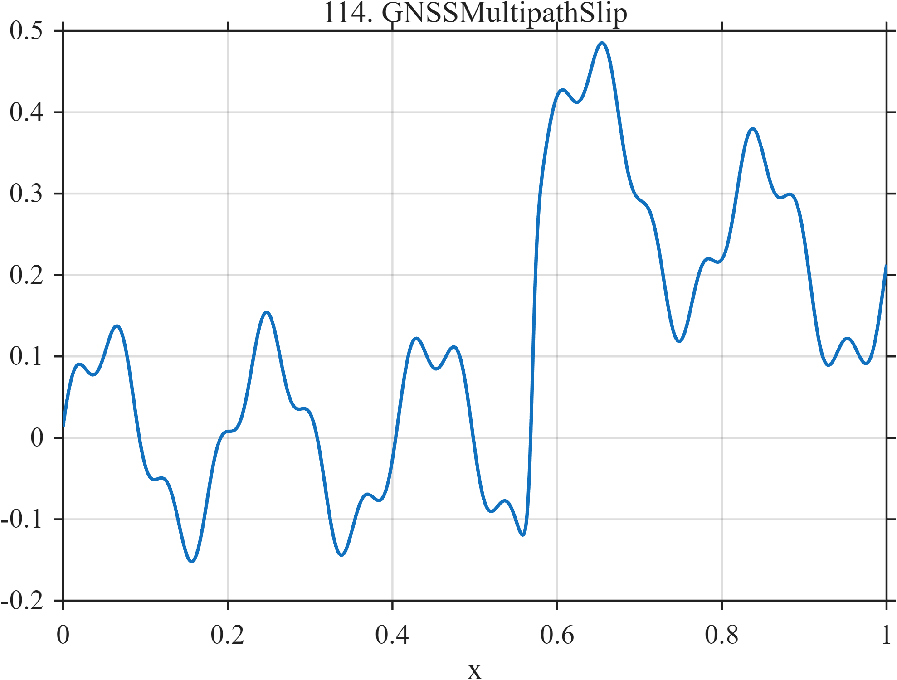

# TF114 — GNSSMultipathSlip

## Overview

The **GNSSMultipathSlip** signal combines smooth multipath oscillations, a sharp positive cycle-slip-like transition, and a gradual post-slip reacquisition adjustment.

## Mathematical Definition

Let $S(x;c,w)=[1+e^{-(x-c)/w}]^{-1}$. Then

$$
\begin{aligned}
f(x)={}&0.12\sin(10\pi x)+0.035\sin(34\pi x+0.4)+0.42S(x;0.57,0.003)\\
&-0.25I(x\ge0.57)[1-e^{-5(x-0.57)}].
\end{aligned}
$$

## Morphological Characteristics

| Property | Description |
|---|---|
| Primary family | Oscillatory background with sharp slip and reacquisition |
| Slip location | $x=0.57$ |
| Background | Two multipath-like oscillatory scales |
| Main challenge | Preserving the slip without phase distortion or artificial ringing |

## Parameters

| Parameter | Meaning | Default |
|---|---|---:|
| $0.42$ | Cycle-slip magnitude | 0.42 |
| $0.003$ | Slip transition width | 0.003 |
| $5$ | Reacquisition rate | 5 |

## MATLAB Implementation

~~~matlab
N=1024; x=linspace(0,1,N); S=@(z,c,w) 1./(1+exp(-(z-c)/w));
f=0.12*sin(2*pi*5*x)+0.035*sin(2*pi*17*x+0.4)+0.42*S(x,0.57,0.003);
u=max(x-0.57,0); f=f-(x>=0.57).*0.25.*(1-exp(-5*u));
plot(x,f); grid on; title('TF114 — GNSSMultipathSlip')
exportgraphics(gcf,'TF114_GNSSMultipathSlip.png','Resolution',300);
~~~

## Python Implementation

~~~python
import numpy as np
import matplotlib.pyplot as plt
N=1024; x=np.linspace(0,1,N); S=lambda c,w: 1/(1+np.exp(-(x-c)/w))
f=.12*np.sin(2*np.pi*5*x)+.035*np.sin(2*np.pi*17*x+.4)+.42*S(.57,.003)
u=np.maximum(x-.57,0); f-=(x>=.57)*.25*(1-np.exp(-5*u))
plt.plot(x,f); plt.grid(alpha=.3); plt.tight_layout()
plt.savefig('TF114_GNSSMultipathSlip.png',dpi=300)
~~~

## Recommended Uses

- GNSS-series denoising
- Cycle-slip localization
- Oscillatory-background preservation

## Provenance

**Status:** GNSS-multipath-and-cycle-slip-inspired deterministic surrogate.

---

[← Previous: SpaceWeatherStorm](TF113_SpaceWeatherStorm.md) | [Category 7 Catalog](index.md) | [Next: HyperspectralMineral →](TF115_HyperspectralMineral.md)
