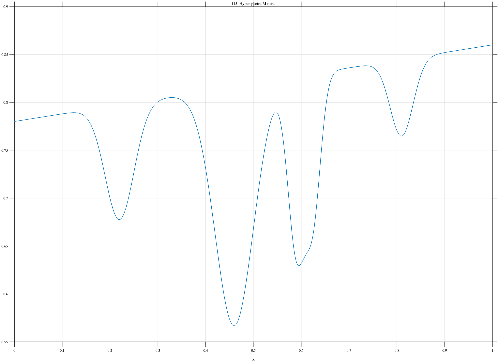

# TF115 — HyperspectralMineral

## Overview

The **HyperspectralMineral** signal contains five absorption bands of unequal amplitude and width on a smooth continuum, including a close pair and a weak diagnostic band.

## Mathematical Definition

Let $g(x;c,w)=e^{-((x-c)/w)^2/2}$. Then

$$
f(x)=0.78+0.08x-\sum_{k=1}^{5}a_k g(x;c_k,w_k),
$$

where

$$
c=(0.22,0.46,0.59,0.625,0.81),\quad
a=(0.12,0.25,0.18,0.14,0.08),
$$

$$
w=(0.030,0.040,0.018,0.016,0.024).
$$

## Morphological Characteristics

| Property | Description |
|---|---|
| Primary family | Unequal spectral absorption bands |
| Close pair | Centers at 0.59 and 0.625 |
| Weak feature | Band at $x=0.81$ with amplitude 0.08 |
| Main challenge | Avoiding merger of close bands and loss of weak diagnostics |

## Parameters

| Parameter | Meaning | Default |
|---|---|---:|
| $c_k$ | Band centers | As above |
| $a_k$ | Band depths | As above |
| $w_k$ | Band widths | As above |

## MATLAB Implementation

~~~matlab
N=1024; x=linspace(0,1,N); f=0.78+0.08*x;
c=[0.22 0.46 0.59 0.625 0.81]; a=[0.12 0.25 0.18 0.14 0.08];
w=[0.030 0.040 0.018 0.016 0.024];
for k=1:numel(c), f=f-a(k)*exp(-0.5*((x-c(k))/w(k)).^2); end
plot(x,f); grid on; title('TF115 — HyperspectralMineral')
exportgraphics(gcf,'TF115_HyperspectralMineral.png','Resolution',300);
~~~

## Python Implementation

~~~python
import numpy as np
import matplotlib.pyplot as plt
N=1024; x=np.linspace(0,1,N); f=.78+.08*x
c=[.22,.46,.59,.625,.81]; a=[.12,.25,.18,.14,.08]; w=[.030,.040,.018,.016,.024]
for ck,ak,wk in zip(c,a,w): f-=ak*np.exp(-.5*((x-ck)/wk)**2)
plt.plot(x,f); plt.grid(alpha=.3); plt.tight_layout()
plt.savefig('TF115_HyperspectralMineral.png',dpi=300)
~~~

## Recommended Uses

- Hyperspectral denoising
- Close-band resolution
- Weak-feature preservation

## Provenance

**Status:** Mineral-reflectance-spectrum-inspired deterministic remote-sensing surrogate.

---

[← Previous: GNSSMultipathSlip](TF114_GNSSMultipathSlip.md) | [Category 7 Catalog](index.md) | [Next: SideChannelPower →](TF116_SideChannelPower.md)
