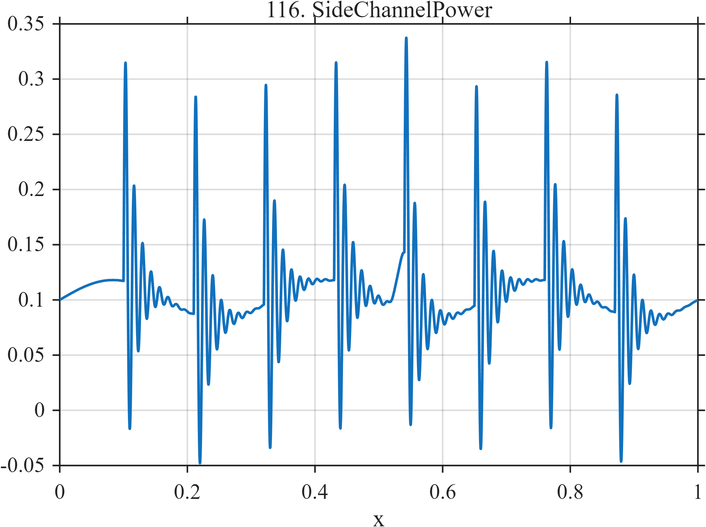

# TF116 — SideChannelPower

## Overview

The **SideChannelPower** signal contains repeated damped computation-like transients and one intentionally weak localized perturbation near the fifth operation.

## Mathematical Definition

Let

$$
\mathcal C=(0.10,0.21,0.32,0.43,0.54,0.65,0.76,0.87).
$$

Then

$$
\begin{aligned}
f(x)={}&0.10+0.018\sin(6\pi x)\\
&+\sum_{c\in\mathcal C}0.24I(x\ge c)e^{-60(x-c)}\sin[2\pi\,75(x-c)]\\
&+0.055e^{-((x-0.54)/0.010)^2/2}.
\end{aligned}
$$

## Morphological Characteristics

| Property | Description |
|---|---|
| Primary family | Repeated damped computation transients |
| Repetition | Eight nominal operation times |
| Weak perturbation | Narrow positive feature near $x=0.54$ |
| Main challenge | Detecting a small operation-specific change in structured activity |

## Parameters

| Parameter | Meaning | Default |
|---|---|---:|
| $60$ | Transient decay rate | 60 |
| $75$ | Transient cycle frequency | 75 |
| $0.055$ | Weak-perturbation amplitude | 0.055 |

## MATLAB Implementation

~~~matlab
N=1024; x=linspace(0,1,N); f=0.10+0.018*sin(2*pi*3*x);
for c=0.10:0.11:0.90
    u=max(x-c,0);
    f=f+0.24*(x>=c).*exp(-60*u).*sin(2*pi*75*u);
end
f=f+0.055*exp(-0.5*((x-0.54)/0.010).^2);
plot(x,f); grid on; title('TF116 — SideChannelPower')
exportgraphics(gcf,'TF116_SideChannelPower.png','Resolution',300);
~~~

## Python Implementation

~~~python
import numpy as np
import matplotlib.pyplot as plt
N=1024; x=np.linspace(0,1,N); f=.10+.018*np.sin(2*np.pi*3*x)
for c in np.arange(.10,.901,.11):
    u=np.maximum(x-c,0); f+=.24*(x>=c)*np.exp(-60*u)*np.sin(2*np.pi*75*u)
f+=.055*np.exp(-.5*((x-.54)/.010)**2)
plt.plot(x,f); plt.grid(alpha=.3); plt.tight_layout()
plt.savefig('TF116_SideChannelPower.png',dpi=300)
~~~

## Recommended Uses

- Side-channel-trace denoising
- Repeated-transient alignment
- Weak-perturbation detection

## Provenance

**Status:** Computation-power-side-channel-inspired deterministic surrogate.

---

[← Previous: HyperspectralMineral](TF115_HyperspectralMineral.md) | [Category 7 Catalog](index.md) | [Next: SecurityBeacon →](TF117_SecurityBeacon.md)
