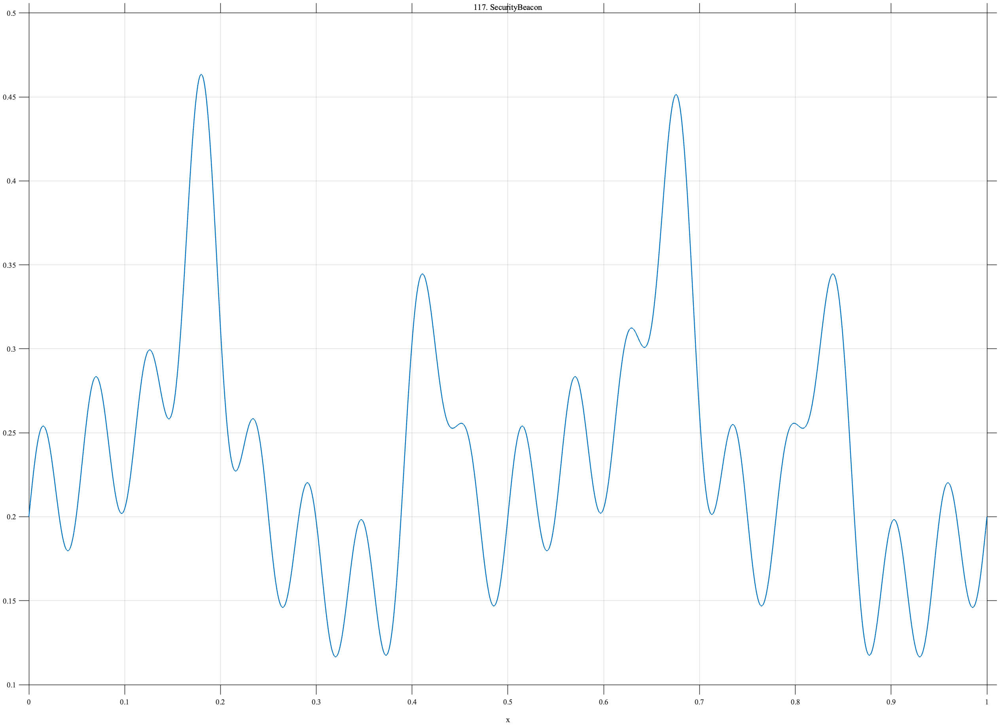

# TF117 — SecurityBeacon

## Overview

The **SecurityBeacon** signal combines four irregular traffic bursts with a weak 18-cycle periodic component and slower background variation.

## Mathematical Definition

Let $g(x;c,w)=e^{-((x-c)/w)^2/2}$. Then

$$
f(x)=0.20+0.05\sin(4\pi x)+0.18\sum_{c\in\{0.18,0.42,0.67,0.83\}}g(x;c,0.020)+0.045\sin(36\pi x).
$$

## Morphological Characteristics

| Property | Description |
|---|---|
| Primary family | Irregular bursts plus weak periodic component |
| Traffic events | Four broad localized bursts |
| Beacon | Low-amplitude 18-cycle oscillation |
| Main challenge | Preserving hidden periodicity within ordinary-looking activity |

## Parameters

| Parameter | Meaning | Default |
|---|---|---:|
| $0.18$ | Traffic-burst amplitude | 0.18 |
| $0.020$ | Traffic-burst width | 0.020 |
| $0.045$ | Beacon amplitude | 0.045 |

## MATLAB Implementation

~~~matlab
N=1024; x=linspace(0,1,N); f=0.20+0.05*sin(2*pi*2*x);
for c=[0.18 0.42 0.67 0.83]
    f=f+0.18*exp(-0.5*((x-c)/0.020).^2);
end
f=f+0.045*sin(2*pi*18*x);
plot(x,f); grid on; title('TF117 — SecurityBeacon')
exportgraphics(gcf,'TF117_SecurityBeacon.png','Resolution',300);
~~~

## Python Implementation

~~~python
import numpy as np
import matplotlib.pyplot as plt
N=1024; x=np.linspace(0,1,N); f=.20+.05*np.sin(2*np.pi*2*x)
for c in [.18,.42,.67,.83]: f+=.18*np.exp(-.5*((x-c)/.020)**2)
f+=.045*np.sin(2*np.pi*18*x)
plt.plot(x,f); plt.grid(alpha=.3); plt.tight_layout()
plt.savefig('TF117_SecurityBeacon.png',dpi=300)
~~~

## Recommended Uses

- Network-telemetry denoising
- Weak-periodicity recovery
- Beacon-detection benchmarking

## Provenance

**Status:** Cybersecurity-beacon-traffic-inspired deterministic surrogate.

---

[← Previous: SideChannelPower](TF116_SideChannelPower.md) | [Category 7 Catalog](index.md) | [Next: GPUThermalThrottle →](TF118_GPUThermalThrottle.md)
