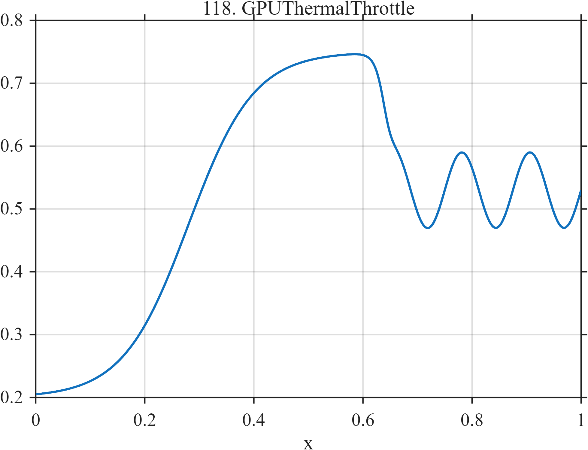

# TF118 — GPUThermalThrottle

## Overview

The **GPUThermalThrottle** signal rises smoothly toward a high-load thermal state, drops sharply at throttling, and develops controller-driven oscillation around the reduced operating level.

## Mathematical Definition

Let $S(x;c,w)=[1+e^{-(x-c)/w}]^{-1}$. Then

$$
f(x)=0.20+0.55S(x;0.28,0.060)-0.22S(x;0.64,0.008)+0.06\sin(16\pi x)S(x;0.64,0.010).
$$

## Morphological Characteristics

| Property | Description |
|---|---|
| Primary family | Smooth rise, sharp throttle, and post-transition oscillation |
| Load/thermal rise | Begins around $x=0.28$ |
| Throttling | Sharp decrease near $x=0.64$ |
| Main challenge | Preserving the controller oscillation after the regime change |

## Parameters

| Parameter | Meaning | Default |
|---|---|---:|
| $0.55$ | Pre-throttle rise | 0.55 |
| $-0.22$ | Throttle drop | -0.22 |
| $0.06$ | Controller-oscillation amplitude | 0.06 |

## MATLAB Implementation

~~~matlab
N=1024; x=linspace(0,1,N); S=@(z,c,w) 1./(1+exp(-(z-c)/w));
f=0.20+0.55*S(x,0.28,0.060);
f=f-0.22*S(x,0.64,0.008)+0.06*sin(2*pi*8*x).*S(x,0.64,0.010);
plot(x,f); grid on; title('TF118 — GPUThermalThrottle')
exportgraphics(gcf,'TF118_GPUThermalThrottle.png','Resolution',300);
~~~

## Python Implementation

~~~python
import numpy as np
import matplotlib.pyplot as plt
N=1024; x=np.linspace(0,1,N); S=lambda c,w: 1/(1+np.exp(-(x-c)/w))
f=.20+.55*S(.28,.060)-.22*S(.64,.008)+.06*np.sin(2*np.pi*8*x)*S(.64,.010)
plt.plot(x,f); plt.grid(alpha=.3); plt.tight_layout()
plt.savefig('TF118_GPUThermalThrottle.png',dpi=300)
~~~

## Recommended Uses

- GPU telemetry smoothing
- Throttling-transition localization
- Controller-oscillation preservation

## Provenance

**Status:** GPU-thermal-throttling-inspired deterministic infrastructure surrogate.

---

[← Previous: SecurityBeacon](TF117_SecurityBeacon.md) | [Category 7 Catalog](index.md) | [Next: MoELoadImbalance →](TF119_MoELoadImbalance.md)
