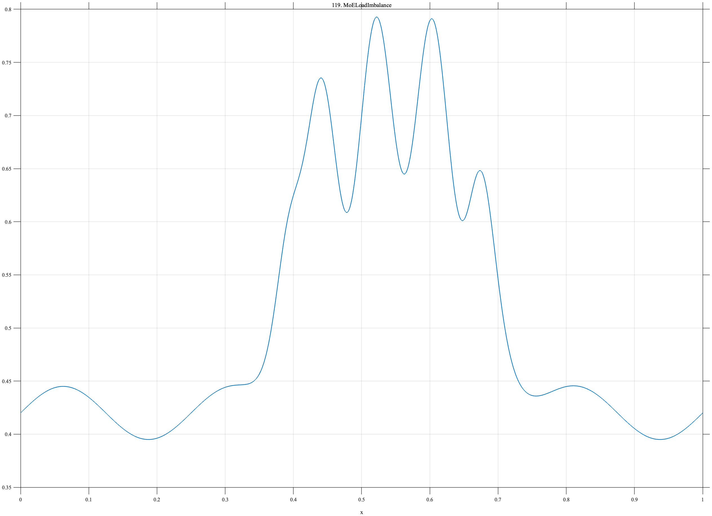

# TF119 — MoELoadImbalance

## Overview

The **MoELoadImbalance** signal begins near a balanced operating level, enters a sustained routing-imbalance interval, exhibits redistributive oscillation, and then recovers.

## Mathematical Definition

Let $S(x;c,w)=[1+e^{-(x-c)/w}]^{-1}$. Then

$$
\begin{aligned}
f(x)={}&0.42+0.025\sin(8\pi x)\\
&+0.28[S(x;0.38,0.012)-S(x;0.70,0.018)]\\
&+0.08\sin(24\pi x)[S(x;0.42,0.015)-S(x;0.68,0.015)].
\end{aligned}
$$

## Morphological Characteristics

| Property | Description |
|---|---|
| Primary family | Finite level imbalance with internal oscillation |
| Imbalance interval | Approximately 0.38–0.70 |
| Redistribution | 12-cycle oscillation within the interval |
| Main challenge | Recovering both regime duration and internal routing dynamics |

## Parameters

| Parameter | Meaning | Default |
|---|---|---:|
| $0.28$ | Imbalance magnitude | 0.28 |
| $0.08$ | Redistribution amplitude | 0.08 |
| $12$ | Redistribution cycle count | 12 |

## MATLAB Implementation

~~~matlab
N=1024; x=linspace(0,1,N); S=@(z,c,w) 1./(1+exp(-(z-c)/w));
f=0.42+0.025*sin(2*pi*4*x);
f=f+0.28*(S(x,0.38,0.012)-S(x,0.70,0.018)) ...
    +0.08*sin(2*pi*12*x).*(S(x,0.42,0.015)-S(x,0.68,0.015));
plot(x,f); grid on; title('TF119 — MoELoadImbalance')
exportgraphics(gcf,'TF119_MoELoadImbalance.png','Resolution',300);
~~~

## Python Implementation

~~~python
import numpy as np
import matplotlib.pyplot as plt
N=1024; x=np.linspace(0,1,N); S=lambda c,w: 1/(1+np.exp(-(x-c)/w))
f=.42+.025*np.sin(2*np.pi*4*x)
f+=.28*(S(.38,.012)-S(.70,.018))+.08*np.sin(2*np.pi*12*x)*(S(.42,.015)-S(.68,.015))
plt.plot(x,f); plt.grid(alpha=.3); plt.tight_layout()
plt.savefig('TF119_MoELoadImbalance.png',dpi=300)
~~~

## Recommended Uses

- AI-infrastructure telemetry smoothing
- Routing-regime detection
- Internal-oscillation preservation

## Provenance

**Status:** Mixture-of-experts-load-routing-inspired deterministic surrogate.

---

[← Previous: GPUThermalThrottle](TF118_GPUThermalThrottle.md) | [Category 7 Catalog](index.md) | [Next: InferenceQueueCollapse →](TF120_InferenceQueueCollapse.md)
