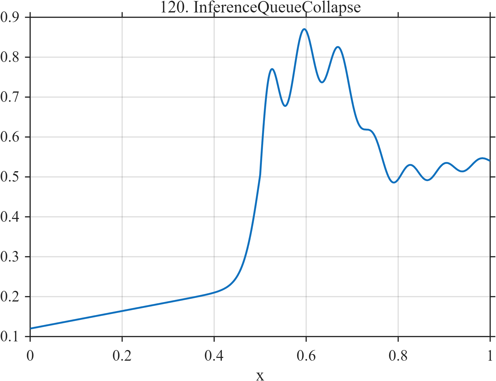

# TF120 — InferenceQueueCollapse

## Overview

The **InferenceQueueCollapse** signal combines a gradual request-load increase, a queueing cliff, a damped autoscaling oscillation, and partial stabilization.

## Mathematical Definition

Let $S(x;c,w)=[1+e^{-(x-c)/w}]^{-1}$ and $u=(x-0.50)_+$. Then

$$
\begin{aligned}
f(x)={}&0.12+0.22x+0.55S(x;0.50,0.018)-0.35S(x;0.72,0.025)\\
&+0.12I(x\ge0.50)e^{-5u}\sin(2\pi\,13u).
\end{aligned}
$$

## Morphological Characteristics

| Property | Description |
|---|---|
| Primary family | Ramp, queueing cliff, damped response, and stabilization |
| Queueing transition | Near $x=0.50$ |
| Stabilization | Begins near $x=0.72$ |
| Main challenge | Retaining autoscaling dynamics around large level changes |

## Parameters

| Parameter | Meaning | Default |
|---|---|---:|
| $0.55$ | Queueing-cliff magnitude | 0.55 |
| $0.35$ | Stabilization reduction | 0.35 |
| $5,13$ | Response decay and cycle frequency | As shown |

## MATLAB Implementation

~~~matlab
N=1024; x=linspace(0,1,N); S=@(z,c,w) 1./(1+exp(-(z-c)/w));
f=0.12+0.22*x+0.55*S(x,0.50,0.018)-0.35*S(x,0.72,0.025);
u=max(x-0.50,0); f=f+(x>=0.50).*0.12.*exp(-5*u).*sin(2*pi*13*u);
plot(x,f); grid on; title('TF120 — InferenceQueueCollapse')
exportgraphics(gcf,'TF120_InferenceQueueCollapse.png','Resolution',300);
~~~

## Python Implementation

~~~python
import numpy as np
import matplotlib.pyplot as plt
N=1024; x=np.linspace(0,1,N); S=lambda c,w: 1/(1+np.exp(-(x-c)/w))
f=.12+.22*x+.55*S(.50,.018)-.35*S(.72,.025)
u=np.maximum(x-.50,0); f+=(x>=.50)*.12*np.exp(-5*u)*np.sin(2*np.pi*13*u)
plt.plot(x,f); plt.grid(alpha=.3); plt.tight_layout()
plt.savefig('TF120_InferenceQueueCollapse.png',dpi=300)
~~~

## Recommended Uses

- Inference-system telemetry smoothing
- Queue-collapse localization
- Damped-controller-response preservation

## Provenance

**Status:** AI-inference-queueing-inspired deterministic infrastructure surrogate.

---

[← Previous: MoELoadImbalance](TF119_MoELoadImbalance.md) | [Category 7 Catalog](index.md) | [Next: CuspChirpStep →](TF121_CuspChirpStep.md)
