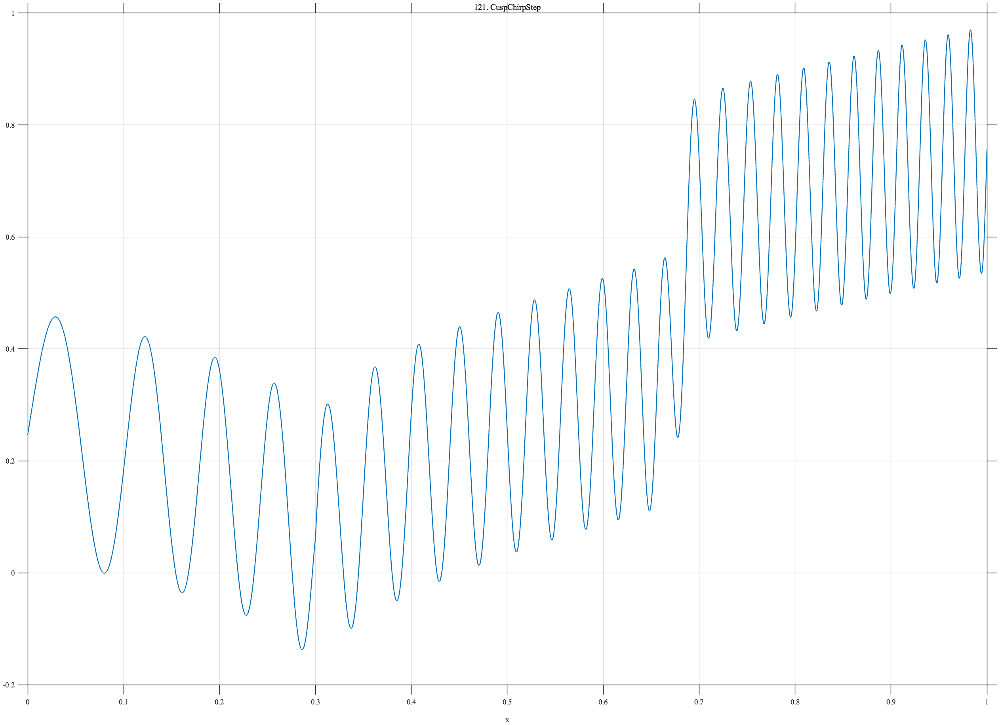

# TF121 — CuspChirpStep

## Overview

The **CuspChirpStep** signal is an artificial stress test combining a cusp, accelerating chirp, smooth trend, and small sharp step in one record.

## Mathematical Definition

Let $S(x;c,w)=[1+e^{-(x-c)/w}]^{-1}$. Then

$$
f(x)=0.45\sqrt{|x-0.30|}+0.22\sin[2\pi(8x+18x^2)]+0.28S(x;0.68,0.004)+0.10x.
$$

## Morphological Characteristics

| Property | Description |
|---|---|
| Primary family | Cusp, chirp, step, and trend |
| Cusp | At $x=0.30$ |
| Step | Near $x=0.68$ |
| Main challenge | Reconciling features that favor different smoothing scales |

## Parameters

| Parameter | Meaning | Default |
|---|---|---:|
| $0.45$ | Cusp amplitude | 0.45 |
| $18$ | Quadratic chirp coefficient | 18 |
| $0.28$ | Step magnitude | 0.28 |

## MATLAB Implementation

~~~matlab
N=1024; x=linspace(0,1,N); S=@(z,c,w) 1./(1+exp(-(z-c)/w));
cusp=0.45*sqrt(abs(x-0.30));
chirp=0.22*sin(2*pi*(8*x+18*x.^2));
step=0.28*S(x,0.68,0.004); trend=0.10*x;
f=cusp+chirp+step+trend;
plot(x,f); grid on; title('TF121 — CuspChirpStep')
exportgraphics(gcf,'TF121_CuspChirpStep.png','Resolution',300);
~~~

## Python Implementation

~~~python
import numpy as np
import matplotlib.pyplot as plt
N=1024; x=np.linspace(0,1,N); S=lambda c,w: 1/(1+np.exp(-(x-c)/w))
cusp=.45*np.sqrt(np.abs(x-.30)); chirp=.22*np.sin(2*np.pi*(8*x+18*x**2))
step=.28*S(.68,.004); trend=.10*x; f=cusp+chirp+step+trend
plt.plot(x,f); plt.grid(alpha=.3); plt.tight_layout()
plt.savefig('TF121_CuspChirpStep.png',dpi=300)
~~~

## Recommended Uses

- Mixed-regularity stress testing
- Cusp and step preservation
- Chirp phase recovery

## Provenance

**Status:** Deliberately artificial multiregularity stress test.

---

[← Previous: InferenceQueueCollapse](TF120_InferenceQueueCollapse.md) | [Category 7 Catalog](index.md) | [Next: PeakForest →](TF122_PeakForest.md)
