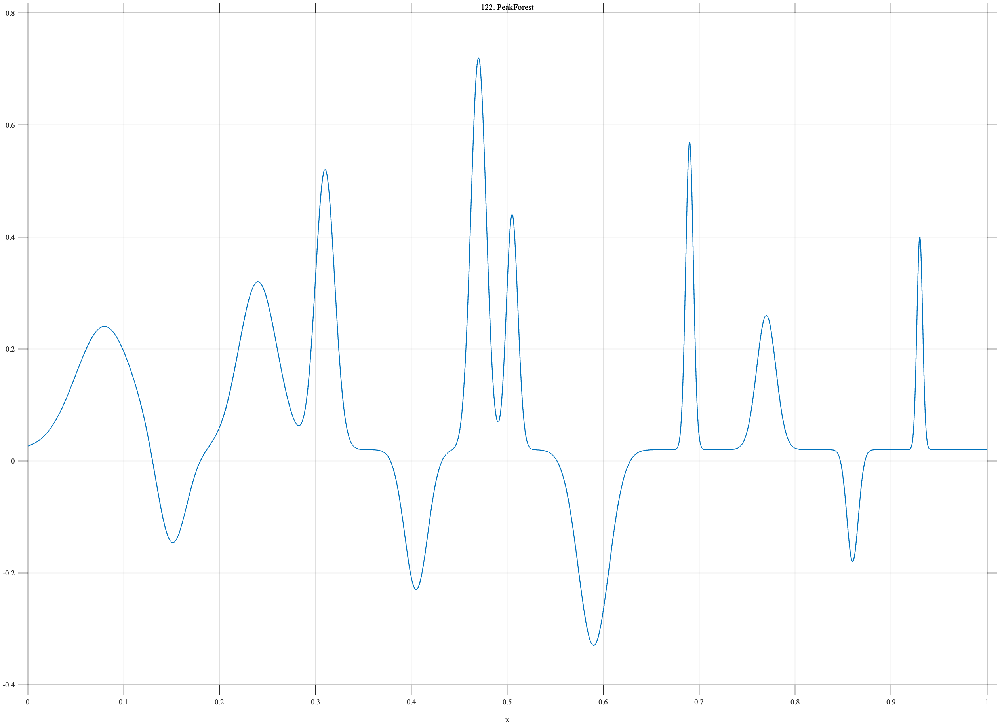

# TF122 — PeakForest

## Overview

The **PeakForest** signal is an artificial collection of twelve positive and negative Gaussian peaks spanning a wide range of amplitudes and widths, including several close neighbors.

## Mathematical Definition

Let $g(x;c,w)=e^{-((x-c)/w)^2/2}$. Then

$$
f(x)=0.02+\sum_{k=1}^{12}a_k g(x;c_k,w_k),
$$

where

$$
c=(0.08,0.15,0.24,0.31,0.405,0.47,0.505,0.59,0.69,0.77,0.86,0.93),
$$

$$
a=(0.22,-0.18,0.30,0.50,-0.25,0.70,0.42,-0.35,0.55,0.24,-0.20,0.38),
$$

$$
w=(0.030,0.015,0.020,0.010,0.012,0.008,0.006,0.016,0.004,0.010,0.006,0.003).
$$

## Morphological Characteristics

| Property | Description |
|---|---|
| Primary family | Multiscale positive and negative peak forest |
| Width range | 0.003–0.030 |
| Amplitude range | -0.35–0.70 |
| Main challenge | No single smoothing bandwidth is suitable for all peaks |

## Parameters

| Parameter | Meaning | Default |
|---|---|---:|
| $c_k$ | Peak centers | As above |
| $a_k$ | Signed amplitudes | As above |
| $w_k$ | Peak widths | As above |

## MATLAB Implementation

~~~matlab
N=1024; x=linspace(0,1,N); f=0.02*ones(size(x));
c=[0.08 0.15 0.24 0.31 0.405 0.47 0.505 0.59 0.69 0.77 0.86 0.93];
a=[0.22 -0.18 0.30 0.50 -0.25 0.70 0.42 -0.35 0.55 0.24 -0.20 0.38];
w=[0.030 0.015 0.020 0.010 0.012 0.008 0.006 0.016 0.004 0.010 0.006 0.003];
for k=1:numel(c), f=f+a(k)*exp(-0.5*((x-c(k))/w(k)).^2); end
plot(x,f); grid on; title('TF122 — PeakForest')
exportgraphics(gcf,'TF122_PeakForest.png','Resolution',300);
~~~

## Python Implementation

~~~python
import numpy as np
import matplotlib.pyplot as plt
N=1024; x=np.linspace(0,1,N); f=.02*np.ones_like(x)
c=[.08,.15,.24,.31,.405,.47,.505,.59,.69,.77,.86,.93]
a=[.22,-.18,.30,.50,-.25,.70,.42,-.35,.55,.24,-.20,.38]
w=[.030,.015,.020,.010,.012,.008,.006,.016,.004,.010,.006,.003]
for ck,ak,wk in zip(c,a,w): f+=ak*np.exp(-.5*((x-ck)/wk)**2)
plt.plot(x,f); plt.grid(alpha=.3); plt.tight_layout()
plt.savefig('TF122_PeakForest.png',dpi=300)
~~~

## Recommended Uses

- Multiscale peak recovery
- Close-feature resolution
- Signed-feature preservation

## Provenance

**Status:** Deliberately artificial multiscale peak stress test.

---

[← Previous: CuspChirpStep](TF121_CuspChirpStep.md) | [Category 7 Catalog](index.md) | [Next: HiddenNeedle →](TF123_HiddenNeedle.md)
