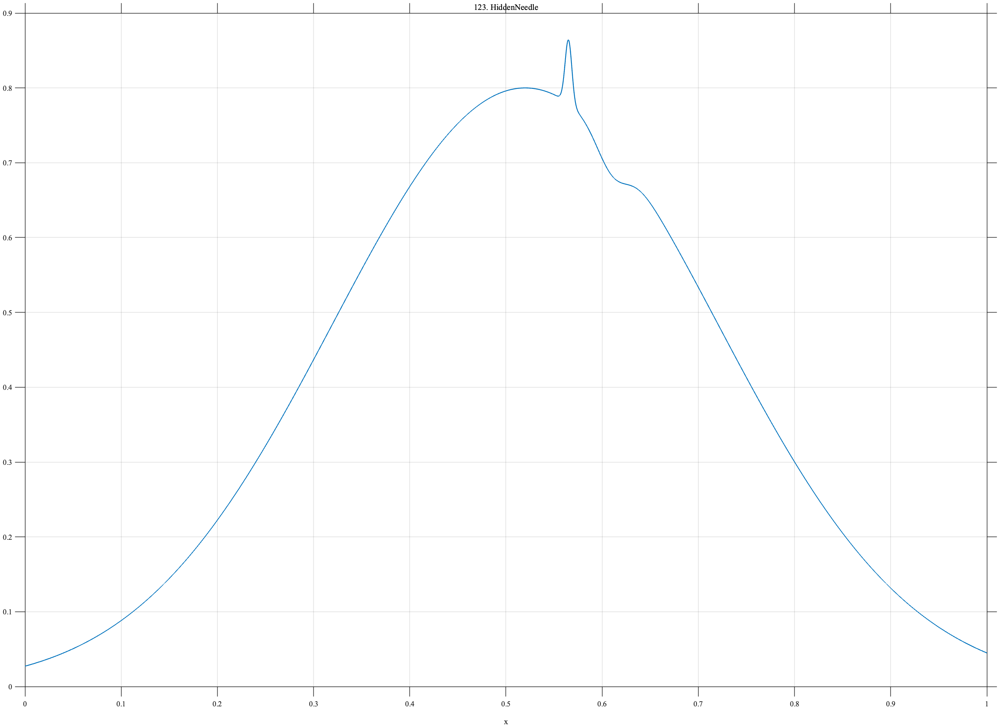

# TF123 — HiddenNeedle

## Overview

The **HiddenNeedle** signal embeds a very narrow low-amplitude peak and a small negative shoulder inside a dominant broad Gaussian feature.

## Mathematical Definition

Let $g(x;c,w)=e^{-((x-c)/w)^2/2}$. Then

$$
f(x)=0.80g(x;0.52,0.20)+0.085g(x;0.565,0.0035)-0.04g(x;0.61,0.016).
$$

## Morphological Characteristics

| Property | Description |
|---|---|
| Primary family | Weak narrow structure inside broad dominant feature |
| Dominant width | 0.20 |
| Needle width | 0.0035 |
| Main challenge | Global error can remain small even if the needle disappears |

## Parameters

| Parameter | Meaning | Default |
|---|---|---:|
| $0.80$ | Broad-feature amplitude | 0.80 |
| $0.085$ | Needle amplitude | 0.085 |
| $-0.04$ | Shoulder amplitude | -0.04 |

## MATLAB Implementation

~~~matlab
N=1024; x=linspace(0,1,N);
broad=0.80*exp(-0.5*((x-0.52)/0.20).^2);
needle=0.085*exp(-0.5*((x-0.565)/0.0035).^2);
shoulder=-0.04*exp(-0.5*((x-0.61)/0.016).^2);
f=broad+needle+shoulder;
plot(x,f); grid on; title('TF123 — HiddenNeedle')
exportgraphics(gcf,'TF123_HiddenNeedle.png','Resolution',300);
~~~

## Python Implementation

~~~python
import numpy as np
import matplotlib.pyplot as plt
N=1024; x=np.linspace(0,1,N)
broad=.80*np.exp(-.5*((x-.52)/.20)**2)
needle=.085*np.exp(-.5*((x-.565)/.0035)**2)
shoulder=-.04*np.exp(-.5*((x-.61)/.016)**2); f=broad+needle+shoulder
plt.plot(x,f); plt.grid(alpha=.3); plt.tight_layout()
plt.savefig('TF123_HiddenNeedle.png',dpi=300)
~~~

## Recommended Uses

- Oversmoothing detection
- Weak-needle preservation
- Feature-aware risk evaluation

## Provenance

**Status:** Deliberately artificial weak-feature stress test.

---

[← Previous: PeakForest](TF122_PeakForest.md) | [Category 7 Catalog](index.md) | [Next: NestedWavePackets →](TF124_NestedWavePackets.md)
