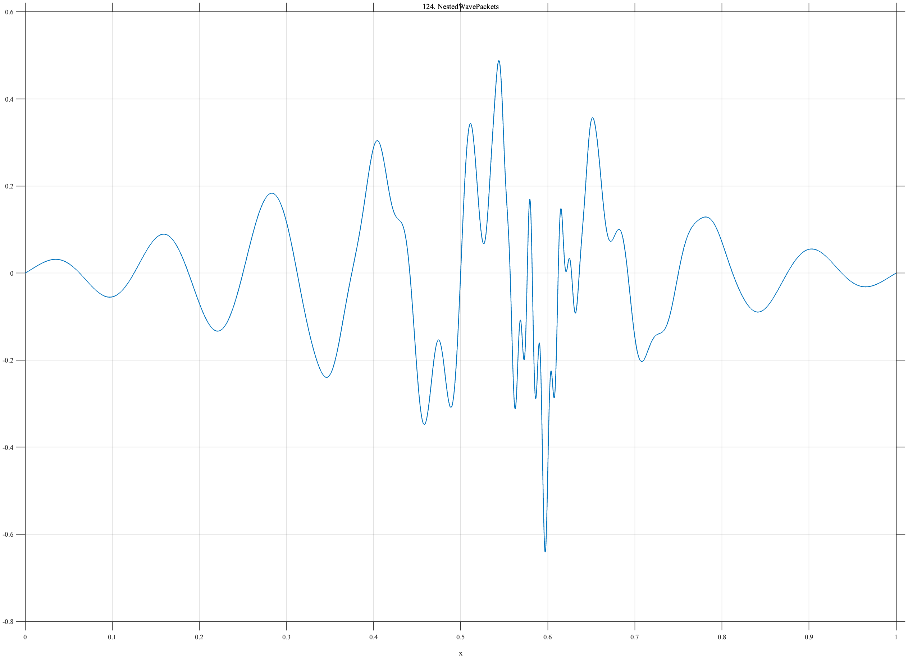

# TF124 — NestedWavePackets

## Overview

The **NestedWavePackets** signal explicitly nests a broad low-frequency packet, a shorter intermediate-frequency packet, and a very short high-frequency burst.

## Mathematical Definition

Let $g(x;c,w)=e^{-((x-c)/w)^2/2}$. Then

$$
\begin{aligned}
f(x)={}&0.30g(x;0.50,0.22)\sin(16\pi x)\\
&+0.24g(x;0.56,0.080)\sin(56\pi x)\\
&+0.17g(x;0.59,0.022)\sin(170\pi x).
\end{aligned}
$$

## Morphological Characteristics

| Property | Description |
|---|---|
| Primary family | Explicitly nested oscillatory packets |
| Packet widths | 0.22, 0.080, and 0.022 |
| Cycle frequencies | 8, 28, and 85 |
| Main challenge | Retaining the shortest packet without fragmenting broad structure |

## Parameters

| Parameter | Meaning | Default |
|---|---|---:|
| $0.30,0.24,0.17$ | Packet amplitudes | As shown |
| $0.50,0.56,0.59$ | Packet centers | As shown |
| $8,28,85$ | Packet cycle frequencies | As shown |

## MATLAB Implementation

~~~matlab
N=1024; x=linspace(0,1,N);
p1=0.30*exp(-0.5*((x-0.50)/0.22).^2).*sin(2*pi*8*x);
p2=0.24*exp(-0.5*((x-0.56)/0.080).^2).*sin(2*pi*28*x);
p3=0.17*exp(-0.5*((x-0.59)/0.022).^2).*sin(2*pi*85*x);
f=p1+p2+p3;
plot(x,f); grid on; title('TF124 — NestedWavePackets')
exportgraphics(gcf,'TF124_NestedWavePackets.png','Resolution',300);
~~~

## Python Implementation

~~~python
import numpy as np
import matplotlib.pyplot as plt
N=1024; x=np.linspace(0,1,N)
p1=.30*np.exp(-.5*((x-.50)/.22)**2)*np.sin(2*np.pi*8*x)
p2=.24*np.exp(-.5*((x-.56)/.080)**2)*np.sin(2*np.pi*28*x)
p3=.17*np.exp(-.5*((x-.59)/.022)**2)*np.sin(2*np.pi*85*x); f=p1+p2+p3
plt.plot(x,f); plt.grid(alpha=.3); plt.tight_layout()
plt.savefig('TF124_NestedWavePackets.png',dpi=300)
~~~

## Recommended Uses

- Multiscale packet denoising
- Local frequency preservation
- Nested-structure recovery

## Provenance

**Status:** Deliberately artificial nested-wave-packet stress test.

---

[← Previous: HiddenNeedle](TF123_HiddenNeedle.md) | [Category 7 Catalog](index.md) | [Next: CancellationTrap →](TF125_CancellationTrap.md)
