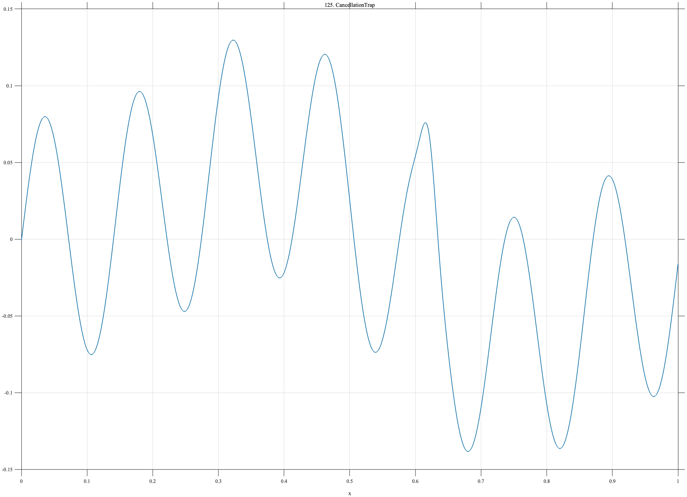

# TF125 — CancellationTrap

## Overview

The **CancellationTrap** signal subtracts two large, similar smooth components, leaving a delicate residual oscillation and a small localized peak.

## Mathematical Definition

Let $g(x;c,w)=e^{-((x-c)/w)^2/2}$. Define

$$
g_1(x)=0.85g(x;0.48,0.19),\qquad
g_2(x)=0.82g(x;0.50,0.20).
$$

Then

$$
f(x)=g_1(x)-g_2(x)+0.08\sin(14\pi x)+0.04g(x;0.62,0.010).
$$

## Morphological Characteristics

| Property | Description |
|---|---|
| Primary family | Near-cancellation with fragile residual |
| Large components | Two broad, nearly matching Gaussians |
| Small feature | Narrow peak near $x=0.62$ |
| Main challenge | Preserving a residual much smaller than its underlying components |

## Parameters

| Parameter | Meaning | Default |
|---|---|---:|
| $0.85,0.82$ | Large-component amplitudes | As shown |
| $0.08$ | Residual-oscillation amplitude | 0.08 |
| $0.04$ | Local-peak amplitude | 0.04 |

## MATLAB Implementation

~~~matlab
N=1024; x=linspace(0,1,N);
g1=0.85*exp(-0.5*((x-0.48)/0.19).^2);
g2=0.82*exp(-0.5*((x-0.50)/0.20).^2);
residual=0.08*sin(2*pi*7*x)+0.04*exp(-0.5*((x-0.62)/0.010).^2);
f=g1-g2+residual;
plot(x,f); grid on; title('TF125 — CancellationTrap')
exportgraphics(gcf,'TF125_CancellationTrap.png','Resolution',300);
~~~

## Python Implementation

~~~python
import numpy as np
import matplotlib.pyplot as plt
N=1024; x=np.linspace(0,1,N)
g1=.85*np.exp(-.5*((x-.48)/.19)**2); g2=.82*np.exp(-.5*((x-.50)/.20)**2)
residual=.08*np.sin(2*np.pi*7*x)+.04*np.exp(-.5*((x-.62)/.010)**2)
f=g1-g2+residual
plt.plot(x,f); plt.grid(alpha=.3); plt.tight_layout()
plt.savefig('TF125_CancellationTrap.png',dpi=300)
~~~

## Recommended Uses

- Cancellation-sensitive denoising
- Delicate-residual preservation
- Weak-local-feature recovery

## Provenance

**Status:** Deliberately artificial near-cancellation stress test.

---

[← Previous: NestedWavePackets](TF124_NestedWavePackets.md) | [Category 7 Catalog](index.md) | Next: end of Category 7
