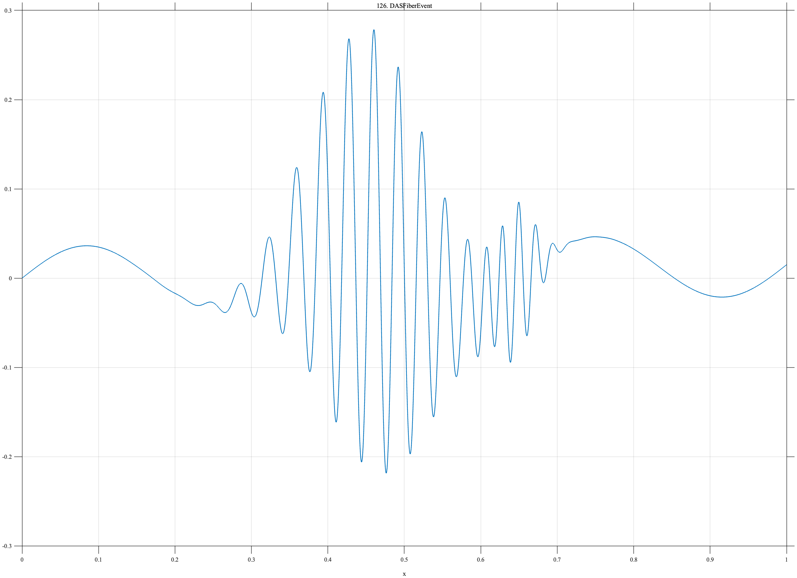

# BEND-1D Category 8

This folder contains GitHub Pages documentation for modern sensing and MishMash stress-test signals **TF126–TF155**.

Upload this folder to:

```text
docs/signals/Category8/
```

Upload the corresponding PNG files to:

```text
docs/assets/images/
```

Each signal page uses an image path such as:

```markdown

```

Add this link to `docs/signals/index.md`:

```markdown
[Browse Category 8 Signals](Category8/)
```

The MATLAB source uses the logistic helper

```matlab
S = @(z,c,w) 1./(1+exp(-(z-c)/w));
```

Each page that requires this helper defines it explicitly, making every implementation standalone.
