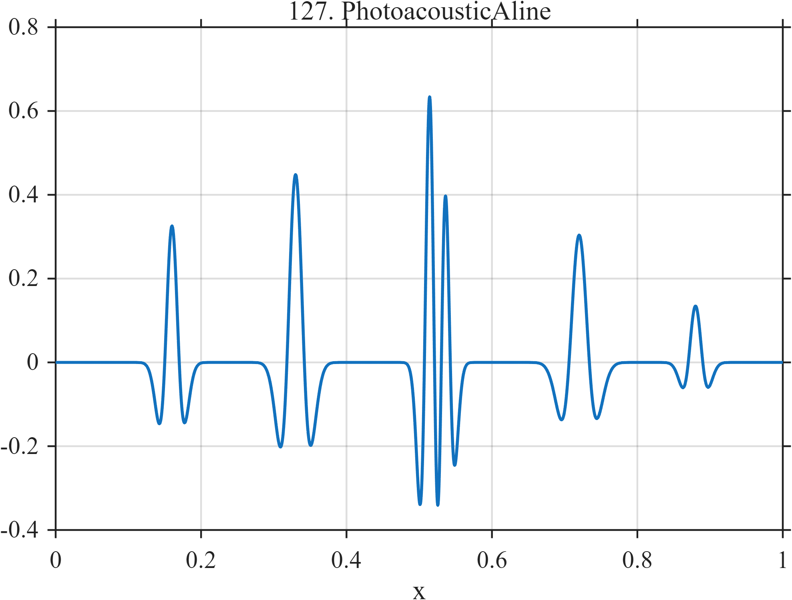

# TF127 — PhotoacousticAline

## Overview

The **PhotoacousticAline** signal contains six bipolar absorber responses of unequal amplitude and width. Two responses are deliberately close and deeper responses are attenuated.

## Mathematical Definition

Let $z_k=(x-c_k)/w_k$. Then

$$
f(x)=e^{-0.45x}\sum_{k=1}^{6}a_k(1-z_k^2)e^{-z_k^2/2},
$$

where

$$
c=(0.16,0.33,0.515,0.535,0.72,0.88),
$$

$$
a=(0.35,0.52,0.95,0.70,0.42,0.20),\quad
w=(0.010,0.012,0.008,0.008,0.014,0.010).
$$

## Morphological Characteristics

| Property | Description |
|---|---|
| Primary family | Unequal bipolar responses with depth attenuation |
| Close pair | Centers at 0.515 and 0.535 |
| Deep response | Weakest absorber at $x=0.88$ |
| Main challenge | Resolving nearby sources without erasing attenuated responses |

## Parameters

| Parameter | Meaning | Default |
|---|---|---:|
| $c_k$ | Absorber locations | As above |
| $a_k$ | Response amplitudes | As above |
| $w_k$ | Response widths | As above |

## MATLAB Implementation

~~~matlab
N=1024; x=linspace(0,1,N); f=zeros(size(x));
c=[0.16 0.33 0.515 0.535 0.72 0.88];
a=[0.35 0.52 0.95 0.70 0.42 0.20]; w=[0.010 0.012 0.008 0.008 0.014 0.010];
for k=1:numel(c)
    z=(x-c(k))/w(k); f=f+a(k)*(1-z.^2).*exp(-0.5*z.^2);
end
f=f.*exp(-0.45*x);
plot(x,f); grid on; title('TF127 — PhotoacousticAline')
exportgraphics(gcf,'TF127_PhotoacousticAline.png','Resolution',300);
~~~

## Python Implementation

~~~python
import numpy as np
import matplotlib.pyplot as plt
N=1024; x=np.linspace(0,1,N); f=np.zeros_like(x)
c=[.16,.33,.515,.535,.72,.88]; a=[.35,.52,.95,.70,.42,.20]
w=[.010,.012,.008,.008,.014,.010]
for ck,ak,wk in zip(c,a,w):
    z=(x-ck)/wk; f+=ak*(1-z**2)*np.exp(-.5*z**2)
f*=np.exp(-.45*x)
plt.plot(x,f); plt.grid(alpha=.3); plt.tight_layout()
plt.savefig('TF127_PhotoacousticAline.png',dpi=300)
~~~

## Recommended Uses

- Photoacoustic A-line denoising
- Bipolar-response resolution
- Depth-attenuated feature preservation

## Provenance

**Status:** Photoacoustic-imaging-inspired deterministic surrogate.

---

[← Previous: DASFiberEvent](TF126_DASFiberEvent.md) | [Category 8 Catalog](index.md) | [Next: OCTRetinalProfile →](TF128_OCTRetinalProfile.md)
