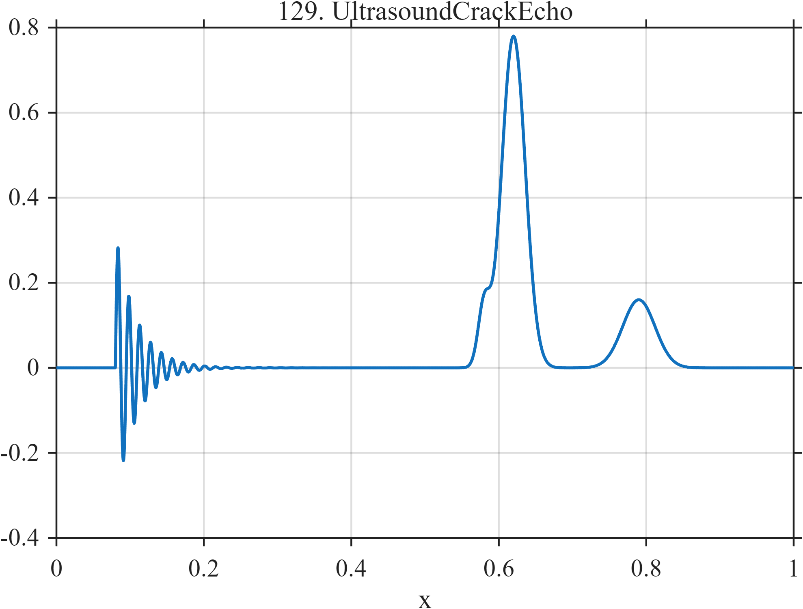

# TF129 — UltrasoundCrackEcho

## Overview

The **UltrasoundCrackEcho** signal begins with transducer ring-down, followed by a small crack echo close to a much larger back-wall reflection and a weaker late reverberation.

## Mathematical Definition

Let $u=(x-0.08)_+$ and $g(x;c,w)=e^{-((x-c)/w)^2/2}$. Then

$$
\begin{aligned}
f(x)={}&0.32I(x\ge0.08)e^{-35u}\sin(2\pi\,68u)\\
&+0.14g(x;0.58,0.008)+0.78g(x;0.62,0.016)+0.16g(x;0.79,0.022).
\end{aligned}
$$

## Morphological Characteristics

| Property | Description |
|---|---|
| Primary family | Ring-down and unequal nearby echoes |
| Crack echo | Small peak near $x=0.58$ |
| Back-wall reflection | Dominant peak near $x=0.62$ |
| Main challenge | Preserving the small crack echo beside a dominant reflector |

## Parameters

| Parameter | Meaning | Default |
|---|---|---:|
| $35$ | Ring-down decay rate | 35 |
| $68$ | Ring-down cycle frequency | 68 |
| $0.14,0.78$ | Crack and back-wall amplitudes | As shown |

## MATLAB Implementation

~~~matlab
N=1024; x=linspace(0,1,N); u=max(x-0.08,0);
ring=(x>=0.08).*0.32.*exp(-35*u).*sin(2*pi*68*u);
crack=0.14*exp(-0.5*((x-0.58)/0.008).^2);
backwall=0.78*exp(-0.5*((x-0.62)/0.016).^2);
reverberation=0.16*exp(-0.5*((x-0.79)/0.022).^2);
f=ring+crack+backwall+reverberation;
plot(x,f); grid on; title('TF129 — UltrasoundCrackEcho')
exportgraphics(gcf,'TF129_UltrasoundCrackEcho.png','Resolution',300);
~~~

## Python Implementation

~~~python
import numpy as np
import matplotlib.pyplot as plt
N=1024; x=np.linspace(0,1,N); u=np.maximum(x-.08,0)
ring=(x>=.08)*.32*np.exp(-35*u)*np.sin(2*np.pi*68*u)
crack=.14*np.exp(-.5*((x-.58)/.008)**2)
backwall=.78*np.exp(-.5*((x-.62)/.016)**2)
reverberation=.16*np.exp(-.5*((x-.79)/.022)**2); f=ring+crack+backwall+reverberation
plt.plot(x,f); plt.grid(alpha=.3); plt.tight_layout()
plt.savefig('TF129_UltrasoundCrackEcho.png',dpi=300)
~~~

## Recommended Uses

- Ultrasonic NDE denoising
- Weak-echo recovery
- Close-reflector resolution

## Provenance

**Status:** Ultrasonic crack-detection-inspired deterministic surrogate.

---

[← Previous: OCTRetinalProfile](TF128_OCTRetinalProfile.md) | [Category 8 Catalog](index.md) | [Next: WearableGaitIMU →](TF130_WearableGaitIMU.md)
