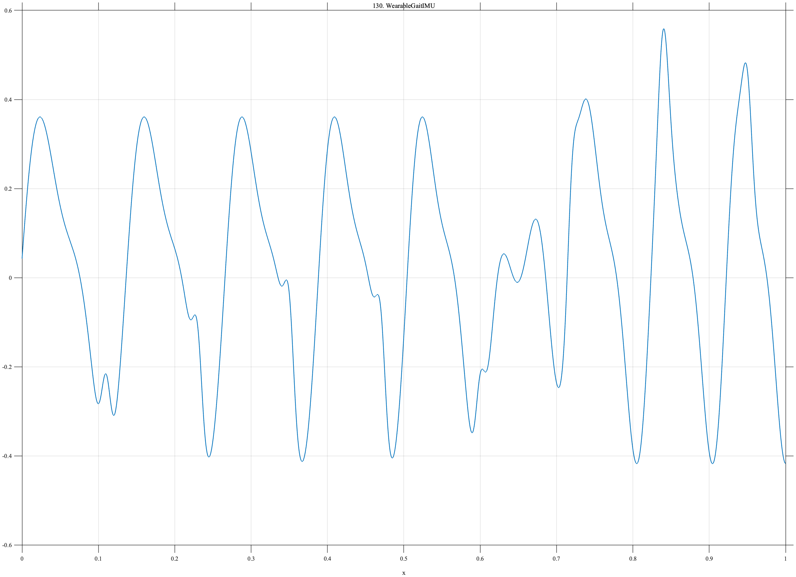

# TF130 — WearableGaitIMU

## Overview

The **WearableGaitIMU** signal combines slowly changing gait cadence, a harmonic waveform, eight heel-strike-like impulses, and a localized stumble with gradual recovery.

## Mathematical Definition

Let $\phi(x)=2\pi(7x+1.8x^2)$ and $g(x;c,w)=e^{-((x-c)/w)^2/2}$. Then

$$
\begin{aligned}
f(x)={}&0.34\sin\phi(x)+0.11\sin[2\phi(x)+0.4]
+0.20\sum_{c\in\mathcal C}g(x;c,0.006)\\
&-0.38g(x;0.64,0.018)+0.20g(x;0.685,0.030),
\end{aligned}
$$

where $\mathcal C=(0.11,0.23,0.35,0.47,0.60,0.72,0.84,0.95)$.

## Morphological Characteristics

| Property | Description |
|---|---|
| Primary family | Quasiperiodic waveform, impulses, and localized disruption |
| Heel strikes | Eight narrow positive events |
| Stumble/recovery | Negative event near 0.64, broad rebound near 0.685 |
| Main challenge | Retaining rhythm and sharp events through a transient disturbance |

## Parameters

| Parameter | Meaning | Default |
|---|---|---:|
| $1.8$ | Cadence-change coefficient | 1.8 |
| $0.006$ | Heel-strike width | 0.006 |
| $-0.38$ | Stumble amplitude | -0.38 |

## MATLAB Implementation

~~~matlab
N=1024; x=linspace(0,1,N); phase=2*pi*(7*x+1.8*x.^2);
f=0.34*sin(phase)+0.11*sin(2*phase+0.4);
centers=[0.11 0.23 0.35 0.47 0.60 0.72 0.84 0.95];
for k=1:numel(centers), f=f+0.20*exp(-0.5*((x-centers(k))/0.006).^2); end
f=f-0.38*exp(-0.5*((x-0.64)/0.018).^2)+0.20*exp(-0.5*((x-0.685)/0.030).^2);
plot(x,f); grid on; title('TF130 — WearableGaitIMU')
exportgraphics(gcf,'TF130_WearableGaitIMU.png','Resolution',300);
~~~

## Python Implementation

~~~python
import numpy as np
import matplotlib.pyplot as plt
N=1024; x=np.linspace(0,1,N); phase=2*np.pi*(7*x+1.8*x**2)
f=.34*np.sin(phase)+.11*np.sin(2*phase+.4)
for c in [.11,.23,.35,.47,.60,.72,.84,.95]: f+=.20*np.exp(-.5*((x-c)/.006)**2)
f+=-.38*np.exp(-.5*((x-.64)/.018)**2)+.20*np.exp(-.5*((x-.685)/.030)**2)
plt.plot(x,f); plt.grid(alpha=.3); plt.tight_layout()
plt.savefig('TF130_WearableGaitIMU.png',dpi=300)
~~~

## Recommended Uses

- Wearable-IMU denoising
- Heel-strike preservation
- Gait-disruption detection

## Provenance

**Status:** Wearable-gait-IMU-inspired deterministic surrogate.

---

[← Previous: UltrasoundCrackEcho](TF129_UltrasoundCrackEcho.md) | [Category 8 Catalog](index.md) | [Next: EEGSeizureOnset →](TF131_EEGSeizureOnset.md)
