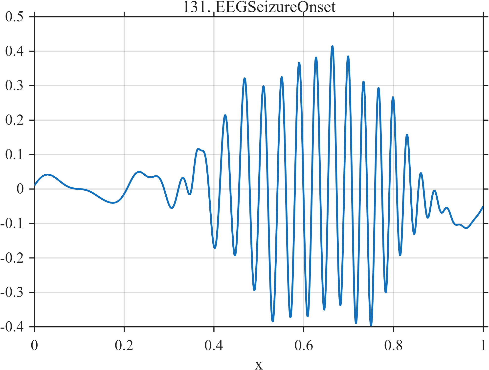

# TF131 — EEGSeizureOnset

## Overview

The **EEGSeizureOnset** signal begins with low-amplitude background activity, includes a weak precursor, develops a finite growing-frequency oscillatory episode, and ends with post-event suppression.

## Mathematical Definition

Let $S(x;c,w)=[1+e^{-(x-c)/w}]^{-1}$ and

$$
E(x)=S(x;0.42,0.05)-S(x;0.82,0.03),\qquad
\phi(x)=2\pi(12x+12x^2).
$$

Then

$$
\begin{aligned}
f(x)={}&0.035\sin(10\pi x)+0.018\sin(18\pi x+0.6)\\
&+0.38E(x)\sin\phi(x)+0.18e^{-((x-0.36)/0.008)^2/2}\\
&-0.06S(x;0.84,0.015).
\end{aligned}
$$

## Morphological Characteristics

| Property | Description |
|---|---|
| Primary family | Weak precursor, oscillatory onset, and suppression |
| Precursor | Narrow peak near $x=0.36$ |
| Seizure-like episode | Approximately 0.42–0.82 |
| Main challenge | Preserving the weak early precursor beside stronger later activity |

## Parameters

| Parameter | Meaning | Default |
|---|---|---:|
| $0.38$ | Episode amplitude | 0.38 |
| $12$ | Quadratic phase coefficient | 12 |
| $-0.06$ | Post-event suppression | -0.06 |

## MATLAB Implementation

~~~matlab
N=1024; x=linspace(0,1,N); S=@(z,c,w) 1./(1+exp(-(z-c)/w));
background=0.035*sin(2*pi*5*x)+0.018*sin(2*pi*9*x+0.6);
env=S(x,0.42,0.05)-S(x,0.82,0.03); phase=2*pi*(12*x+12*x.^2);
f=background+0.38*env.*sin(phase)+0.18*exp(-0.5*((x-0.36)/0.008).^2)-0.06*S(x,0.84,0.015);
plot(x,f); grid on; title('TF131 — EEGSeizureOnset')
exportgraphics(gcf,'TF131_EEGSeizureOnset.png','Resolution',300);
~~~

## Python Implementation

~~~python
import numpy as np
import matplotlib.pyplot as plt
N=1024; x=np.linspace(0,1,N); S=lambda c,w: 1/(1+np.exp(-(x-c)/w))
background=.035*np.sin(2*np.pi*5*x)+.018*np.sin(2*np.pi*9*x+.6)
env=S(.42,.05)-S(.82,.03); phase=2*np.pi*(12*x+12*x**2)
f=background+.38*env*np.sin(phase)+.18*np.exp(-.5*((x-.36)/.008)**2)-.06*S(.84,.015)
plt.plot(x,f); plt.grid(alpha=.3); plt.tight_layout()
plt.savefig('TF131_EEGSeizureOnset.png',dpi=300)
~~~

## Recommended Uses

- EEG denoising
- Weak-precursor preservation
- Oscillatory-onset localization

## Provenance

**Status:** Seizure-onset-EEG-inspired deterministic surrogate; not a clinical simulator.

---

[← Previous: WearableGaitIMU](TF130_WearableGaitIMU.md) | [Category 8 Catalog](index.md) | [Next: MRFreeInductionDecay →](TF132_MRFreeInductionDecay.md)
