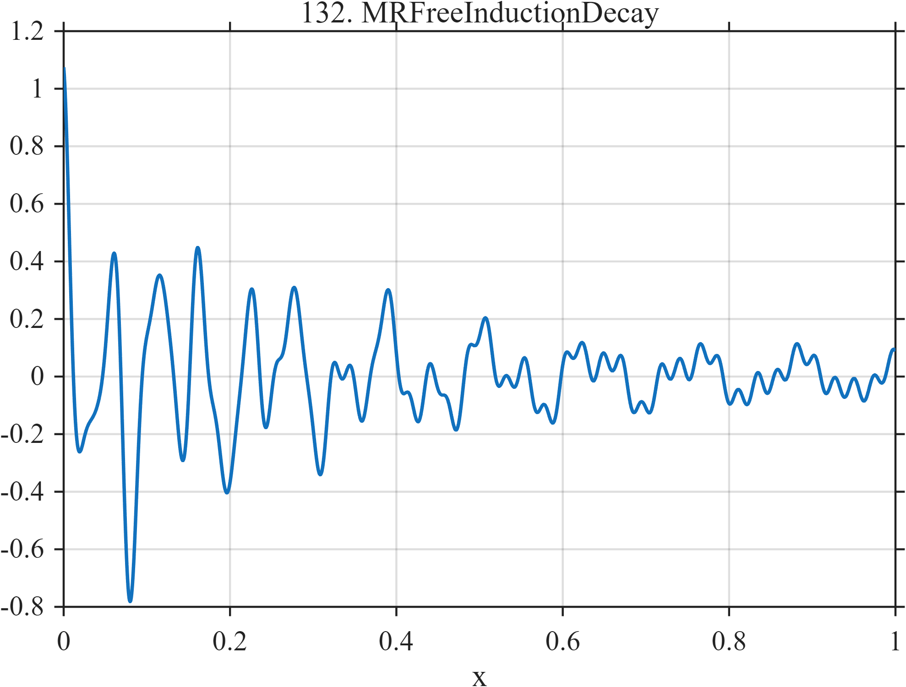

# TF132 — MRFreeInductionDecay

## Overview

The **MRFreeInductionDecay** signal sums four damped oscillations with different frequencies, phases, amplitudes, and relaxation rates. One component is weak but long-lived.

## Mathematical Definition

$$
\begin{aligned}
f(x)={}&0.55e^{-3.5x}\cos(36\pi x)
+0.34e^{-7x}\cos(62\pi x+0.3)\\
&+0.18e^{-1.2x}\cos(16\pi x-0.5)
+0.06e^{-0.55x}\cos(86\pi x+0.8).
\end{aligned}
$$

## Morphological Characteristics

| Property | Description |
|---|---|
| Primary family | Multicomponent damped oscillation |
| Frequencies | 8, 18, 31, and 43 cycles |
| Relaxation rates | 0.55, 1.2, 3.5, and 7 |
| Main challenge | Preserving weak, long-lived spectral information |

## Parameters

| Parameter | Meaning | Default |
|---|---|---:|
| $0.55,0.34,0.18,0.06$ | Component amplitudes | As shown |
| $3.5,7,1.2,0.55$ | Decay rates | As shown |

## MATLAB Implementation

~~~matlab
N=1024; x=linspace(0,1,N);
f=0.55*exp(-3.5*x).*cos(2*pi*18*x) ...
 +0.34*exp(-7*x).*cos(2*pi*31*x+0.3) ...
 +0.18*exp(-1.2*x).*cos(2*pi*8*x-0.5) ...
 +0.06*exp(-0.55*x).*cos(2*pi*43*x+0.8);
plot(x,f); grid on; title('TF132 — MRFreeInductionDecay')
exportgraphics(gcf,'TF132_MRFreeInductionDecay.png','Resolution',300);
~~~

## Python Implementation

~~~python
import numpy as np
import matplotlib.pyplot as plt
N=1024; x=np.linspace(0,1,N)
f=.55*np.exp(-3.5*x)*np.cos(2*np.pi*18*x)
f+=.34*np.exp(-7*x)*np.cos(2*np.pi*31*x+.3)
f+=.18*np.exp(-1.2*x)*np.cos(2*np.pi*8*x-.5)
f+=.06*np.exp(-.55*x)*np.cos(2*np.pi*43*x+.8)
plt.plot(x,f); plt.grid(alpha=.3); plt.tight_layout()
plt.savefig('TF132_MRFreeInductionDecay.png',dpi=300)
~~~

## Recommended Uses

- MR free-induction denoising
- Multirate-decay recovery
- Weak spectral-component preservation

## Provenance

**Status:** Magnetic-resonance-FID-inspired deterministic surrogate.

---

[← Previous: EEGSeizureOnset](TF131_EEGSeizureOnset.md) | [Category 8 Catalog](index.md) | [Next: ATACChromatinAccessibility →](TF133_ATACChromatinAccessibility.md)
