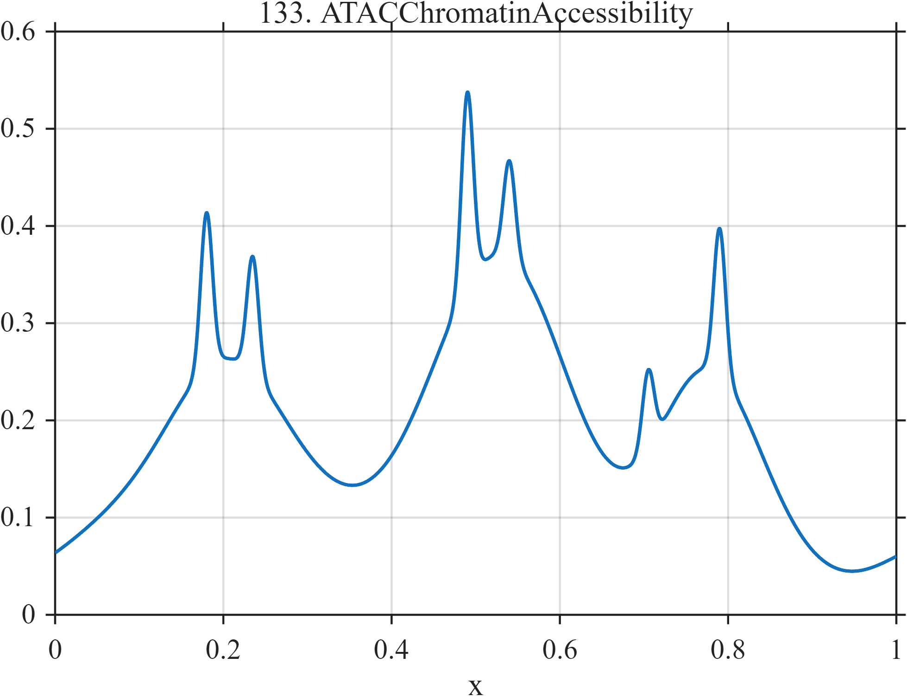

# TF133 — ATACChromatinAccessibility

## Overview

The **ATACChromatinAccessibility** signal places six narrow regulatory-like peaks within three broad accessibility regions of unequal scale.

## Mathematical Definition

Let $g(x;c,w)=e^{-((x-c)/w)^2/2}$. Then

$$
f(x)=0.06+0.018\sin(8\pi x)+\sum_{k=1}^{3}a_k g(x;c_k,w_k)+\sum_{j=1}^{6}b_j g(x;d_j,0.007),
$$

where

$$
c=(0.20,0.52,0.77),\ a=(0.22,0.30,0.18),\ w=(0.070,0.085,0.060),
$$

$$
d=(0.18,0.235,0.49,0.54,0.705,0.79),\quad
b=(0.16,0.12,0.20,0.10,0.08,0.15).
$$

## Morphological Characteristics

| Property | Description |
|---|---|
| Primary family | Broad regions containing narrow peaks |
| Broad scales | Widths 0.060–0.085 |
| Narrow scale | Common width 0.007 |
| Main challenge | Recovering regional and localized genomic structure together |

## Parameters

| Parameter | Meaning | Default |
|---|---|---:|
| $c_k,a_k,w_k$ | Broad-region parameters | As above |
| $d_j,b_j$ | Narrow-peak centers and amplitudes | As above |

## MATLAB Implementation

~~~matlab
N=1024; x=linspace(0,1,N); f=0.06+0.018*sin(2*pi*4*x);
c=[0.20 0.52 0.77]; a=[0.22 0.30 0.18]; w=[0.070 0.085 0.060];
for k=1:numel(c), f=f+a(k)*exp(-0.5*((x-c(k))/w(k)).^2); end
d=[0.18 0.235 0.49 0.54 0.705 0.79]; b=[0.16 0.12 0.20 0.10 0.08 0.15];
for k=1:numel(d), f=f+b(k)*exp(-0.5*((x-d(k))/0.007).^2); end
plot(x,f); grid on; title('TF133 — ATACChromatinAccessibility')
exportgraphics(gcf,'TF133_ATACChromatinAccessibility.png','Resolution',300);
~~~

## Python Implementation

~~~python
import numpy as np
import matplotlib.pyplot as plt
N=1024; x=np.linspace(0,1,N); f=.06+.018*np.sin(2*np.pi*4*x)
c=[.20,.52,.77]; a=[.22,.30,.18]; w=[.070,.085,.060]
for ck,ak,wk in zip(c,a,w): f+=ak*np.exp(-.5*((x-ck)/wk)**2)
d=[.18,.235,.49,.54,.705,.79]; b=[.16,.12,.20,.10,.08,.15]
for dk,bk in zip(d,b): f+=bk*np.exp(-.5*((x-dk)/.007)**2)
plt.plot(x,f); plt.grid(alpha=.3); plt.tight_layout()
plt.savefig('TF133_ATACChromatinAccessibility.png',dpi=300)
~~~

## Recommended Uses

- Chromatin-accessibility smoothing
- Broad/narrow scale separation
- Weak regulatory-peak preservation

## Provenance

**Status:** ATAC-seq-accessibility-profile-inspired deterministic genomic surrogate.

---

[← Previous: MRFreeInductionDecay](TF132_MRFreeInductionDecay.md) | [Category 8 Catalog](index.md) | [Next: WindTurbineGustControl →](TF134_WindTurbineGustControl.md)
