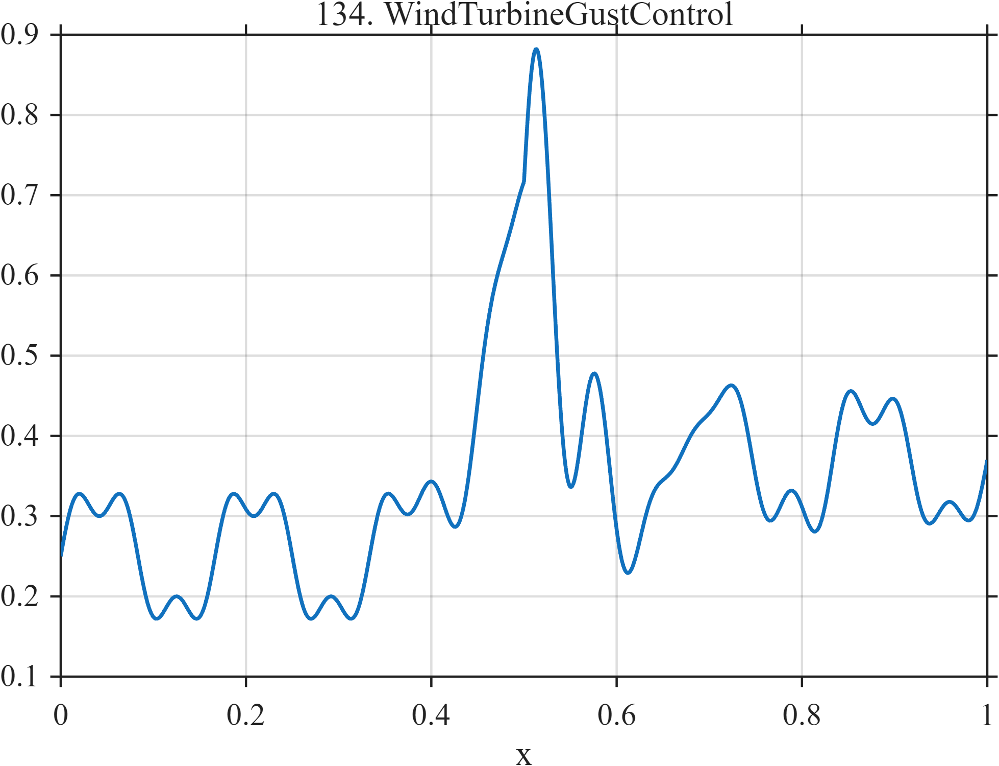

# TF134 — WindTurbineGustControl

## Overview

The **WindTurbineGustControl** signal combines two blade-related oscillations, a strong gust, a damped controller response, and a shifted operating level.

## Mathematical Definition

Let $S(x;c,w)=[1+e^{-(x-c)/w}]^{-1}$ and $u=(x-0.50)_+$. Then

$$
\begin{aligned}
f(x)={}&0.25+0.08\sin(12\pi x)+0.03\sin(36\pi x)\\
&+0.48e^{-((x-0.49)/0.035)^2/2}\\
&+0.20I(x\ge0.50)e^{-9u}\sin(30\pi u)+0.12S(x;0.56,0.020).
\end{aligned}
$$

## Morphological Characteristics

| Property | Description |
|---|---|
| Primary family | Periodic baseline, gust, control response, and shift |
| Gust | Broad event centered near $x=0.49$ |
| Controller response | Damped oscillation after $x=0.50$ |
| Main challenge | Preserving smooth periodic behavior and abrupt forcing together |

## Parameters

| Parameter | Meaning | Default |
|---|---|---:|
| $0.48$ | Gust amplitude | 0.48 |
| $9$ | Control-response decay rate | 9 |
| $0.12$ | Operating-level shift | 0.12 |

## MATLAB Implementation

~~~matlab
N=1024; x=linspace(0,1,N); S=@(z,c,w) 1./(1+exp(-(z-c)/w));
u=max(x-0.50,0);
f=0.25+0.08*sin(2*pi*6*x)+0.03*sin(2*pi*18*x) ...
 +0.48*exp(-0.5*((x-0.49)/0.035).^2) ...
 +(x>=0.50).*0.20.*exp(-9*u).*sin(2*pi*15*u)+0.12*S(x,0.56,0.020);
plot(x,f); grid on; title('TF134 — WindTurbineGustControl')
exportgraphics(gcf,'TF134_WindTurbineGustControl.png','Resolution',300);
~~~

## Python Implementation

~~~python
import numpy as np
import matplotlib.pyplot as plt
N=1024; x=np.linspace(0,1,N); S=lambda c,w: 1/(1+np.exp(-(x-c)/w)); u=np.maximum(x-.50,0)
f=.25+.08*np.sin(2*np.pi*6*x)+.03*np.sin(2*np.pi*18*x)
f+=.48*np.exp(-.5*((x-.49)/.035)**2)+(x>=.50)*.20*np.exp(-9*u)*np.sin(2*np.pi*15*u)
f+=.12*S(.56,.020)
plt.plot(x,f); plt.grid(alpha=.3); plt.tight_layout()
plt.savefig('TF134_WindTurbineGustControl.png',dpi=300)
~~~

## Recommended Uses

- Wind-turbine telemetry denoising
- Gust-event recovery
- Controller-response preservation

## Provenance

**Status:** Wind-turbine-gust-control-inspired deterministic surrogate.

---

[← Previous: ATACChromatinAccessibility](TF133_ATACChromatinAccessibility.md) | [Category 8 Catalog](index.md) | [Next: EVFastCharge →](TF135_EVFastCharge.md)
