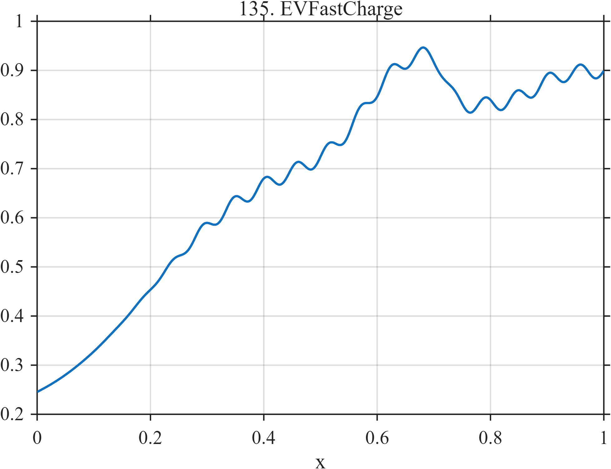

# TF135 — EVFastCharge

## Overview

The **EVFastCharge** signal contains a long nonlinear rise, an intermediate charging-regime change, thermal derating, small control ripple, and final saturation.

## Mathematical Definition

Let $S(x;c,w)=[1+e^{-(x-c)/w}]^{-1}$. Then

$$
\begin{aligned}
f(x)={}&0.18+0.55S(x;0.20,0.10)+0.22S(x;0.58,0.035)\\
&-0.12S(x;0.72,0.010)+0.015\sin(36\pi x)S(x;0.25,0.03)\\
&+0.07S(x;0.88,0.025).
\end{aligned}
$$

## Morphological Characteristics

| Property | Description |
|---|---|
| Primary family | Smooth rise with multiple regime changes and ripple |
| Derating | Negative transition near $x=0.72$ |
| Saturation | Final increase near $x=0.88$ |
| Main challenge | Retaining subtle transitions within a dominant smooth trend |

## Parameters

| Parameter | Meaning | Default |
|---|---|---:|
| $0.20,0.58$ | Rise and regime-change centers | As shown |
| $-0.12$ | Derating magnitude | -0.12 |
| $0.015$ | Control-ripple amplitude | 0.015 |

## MATLAB Implementation

~~~matlab
N=1024; x=linspace(0,1,N); S=@(z,c,w) 1./(1+exp(-(z-c)/w));
f=0.18+0.55*S(x,0.20,0.10)+0.22*S(x,0.58,0.035)-0.12*S(x,0.72,0.010) ...
 +0.015*sin(2*pi*18*x).*S(x,0.25,0.03)+0.07*S(x,0.88,0.025);
plot(x,f); grid on; title('TF135 — EVFastCharge')
exportgraphics(gcf,'TF135_EVFastCharge.png','Resolution',300);
~~~

## Python Implementation

~~~python
import numpy as np
import matplotlib.pyplot as plt
N=1024; x=np.linspace(0,1,N); S=lambda c,w: 1/(1+np.exp(-(x-c)/w))
f=.18+.55*S(.20,.10)+.22*S(.58,.035)-.12*S(.72,.010)
f+=.015*np.sin(2*np.pi*18*x)*S(.25,.03)+.07*S(.88,.025)
plt.plot(x,f); plt.grid(alpha=.3); plt.tight_layout()
plt.savefig('TF135_EVFastCharge.png',dpi=300)
~~~

## Recommended Uses

- EV charging-curve smoothing
- Regime-transition preservation
- Low-amplitude ripple recovery

## Provenance

**Status:** Electric-vehicle-fast-charging-inspired deterministic surrogate.

---

[← Previous: WindTurbineGustControl](TF134_WindTurbineGustControl.md) | [Category 8 Catalog](index.md) | [Next: GridInverterOscillation →](TF136_GridInverterOscillation.md)
