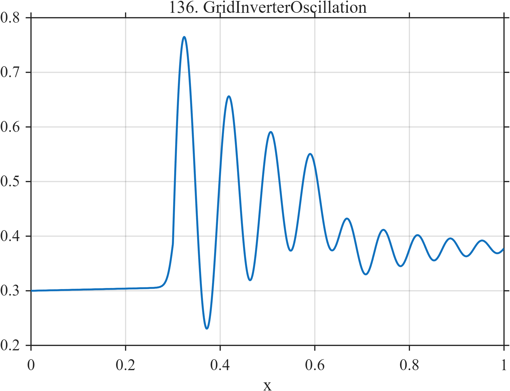

# TF136 — GridInverterOscillation

## Overview

The **GridInverterOscillation** signal combines a load disturbance, decaying oscillation with changing instantaneous frequency, and later controller intervention.

## Mathematical Definition

Let $S(x;c,w)=[1+e^{-(x-c)/w}]^{-1}$ and $u=(x-0.30)_+$. Then

$$
\begin{aligned}
f(x)={}&0.30+0.02x+0.16S(x;0.30,0.006)\\
&+0.34I(x\ge0.30)e^{-5u}\sin[2\pi(10u+4u^2)]\\
&-0.10S(x;0.64,0.010).
\end{aligned}
$$

## Morphological Characteristics

| Property | Description |
|---|---|
| Primary family | Load step, decaying chirp, and controller intervention |
| Disturbance | Near $x=0.30$ |
| Intervention | Negative transition near $x=0.64$ |
| Main challenge | Preserving transient phase and the later control change |

## Parameters

| Parameter | Meaning | Default |
|---|---|---:|
| $5$ | Oscillation decay rate | 5 |
| $4$ | Quadratic phase coefficient | 4 |
| $-0.10$ | Controller-shift magnitude | -0.10 |

## MATLAB Implementation

~~~matlab
N=1024; x=linspace(0,1,N); S=@(z,c,w) 1./(1+exp(-(z-c)/w));
u=max(x-0.30,0);
f=0.30+0.02*x+0.16*S(x,0.30,0.006) ...
 +(x>=0.30).*0.34.*exp(-5*u).*sin(2*pi*(10*u+4*u.^2)) ...
 -0.10*S(x,0.64,0.010);
plot(x,f); grid on; title('TF136 — GridInverterOscillation')
exportgraphics(gcf,'TF136_GridInverterOscillation.png','Resolution',300);
~~~

## Python Implementation

~~~python
import numpy as np
import matplotlib.pyplot as plt
N=1024; x=np.linspace(0,1,N); S=lambda c,w: 1/(1+np.exp(-(x-c)/w)); u=np.maximum(x-.30,0)
f=.30+.02*x+.16*S(.30,.006)
f+=(x>=.30)*.34*np.exp(-5*u)*np.sin(2*np.pi*(10*u+4*u**2))-.10*S(.64,.010)
plt.plot(x,f); plt.grid(alpha=.3); plt.tight_layout()
plt.savefig('TF136_GridInverterOscillation.png',dpi=300)
~~~

## Recommended Uses

- Grid-inverter telemetry denoising
- Phase-preserving transient recovery
- Controller-intervention localization

## Provenance

**Status:** Grid-inverter-disturbance-inspired deterministic surrogate.

---

[← Previous: EVFastCharge](TF135_EVFastCharge.md) | [Category 8 Catalog](index.md) | [Next: SatelliteReactionWheel →](TF137_SatelliteReactionWheel.md)
