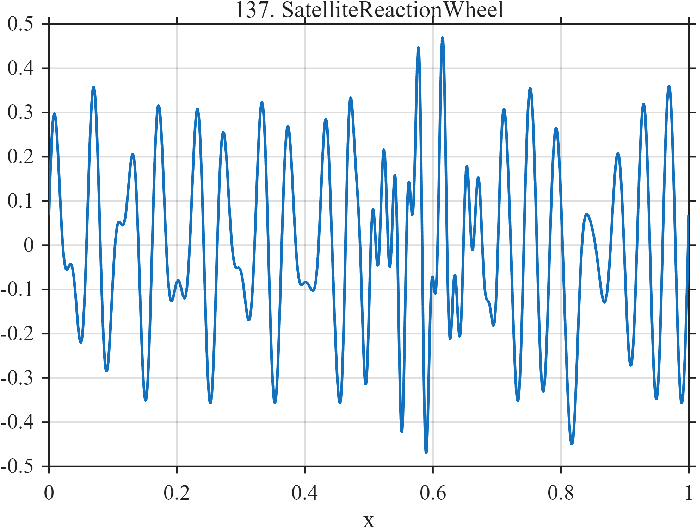

# TF137 — SatelliteReactionWheel

## Overview

The **SatelliteReactionWheel** signal combines two slowly varying wheel harmonics, a localized high-frequency resonance crossing, and a narrow momentum-dump-like impulse.

## Mathematical Definition

Let

$$
\phi_1(x)=2\pi(18x+3x^2),\qquad
\phi_2(x)=2\pi(31x-2x^2).
$$

Then

$$
\begin{aligned}
f(x)={}&0.22\sin\phi_1(x)+0.14\sin[\phi_2(x)+0.5]\\
&+0.20e^{-((x-0.58)/0.065)^2/2}\sin(108\pi x)\\
&-0.32e^{-((x-0.82)/0.008)^2/2}.
\end{aligned}
$$

## Morphological Characteristics

| Property | Description |
|---|---|
| Primary family | Persistent harmonics, resonance packet, and sparse impulse |
| Resonance | Localized near $x=0.58$ |
| Momentum-dump-like event | Narrow negative impulse near $x=0.82$ |
| Main challenge | Preserving a sparse event within nonstationary vibration |

## Parameters

| Parameter | Meaning | Default |
|---|---|---:|
| $18,31$ | Nominal wheel-harmonic cycles | As shown |
| $54$ | Resonance cycle frequency | 54 |
| $-0.32$ | Impulse amplitude | -0.32 |

## MATLAB Implementation

~~~matlab
N=1024; x=linspace(0,1,N);
phase1=2*pi*(18*x+3*x.^2); phase2=2*pi*(31*x-2*x.^2);
f=0.22*sin(phase1)+0.14*sin(phase2+0.5) ...
 +0.20*exp(-0.5*((x-0.58)/0.065).^2).*sin(2*pi*54*x) ...
 -0.32*exp(-0.5*((x-0.82)/0.008).^2);
plot(x,f); grid on; title('TF137 — SatelliteReactionWheel')
exportgraphics(gcf,'TF137_SatelliteReactionWheel.png','Resolution',300);
~~~

## Python Implementation

~~~python
import numpy as np
import matplotlib.pyplot as plt
N=1024; x=np.linspace(0,1,N)
phase1=2*np.pi*(18*x+3*x**2); phase2=2*np.pi*(31*x-2*x**2)
f=.22*np.sin(phase1)+.14*np.sin(phase2+.5)
f+=.20*np.exp(-.5*((x-.58)/.065)**2)*np.sin(2*np.pi*54*x)
f-=.32*np.exp(-.5*((x-.82)/.008)**2)
plt.plot(x,f); plt.grid(alpha=.3); plt.tight_layout()
plt.savefig('TF137_SatelliteReactionWheel.png',dpi=300)
~~~

## Recommended Uses

- Spacecraft-vibration denoising
- Resonance-packet recovery
- Sparse-event preservation

## Provenance

**Status:** Satellite-reaction-wheel-inspired deterministic surrogate.

---

[← Previous: GridInverterOscillation](TF136_GridInverterOscillation.md) | [Category 8 Catalog](index.md) | [Next: MicrofluidicDropletTrain →](TF138_MicrofluidicDropletTrain.md)
