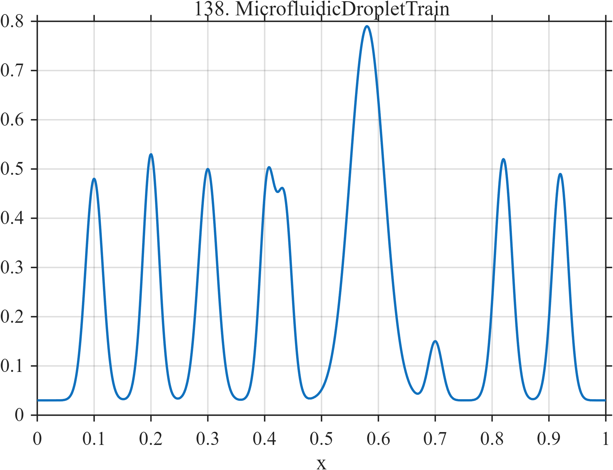

# TF138 — MicrofluidicDropletTrain

## Overview

The **MicrofluidicDropletTrain** signal contains nine droplet-like pulses with unequal amplitudes and widths, including a close doublet, one broad coalesced event, and one very weak droplet.

## Mathematical Definition

Let $g(x;c,w)=e^{-((x-c)/w)^2/2}$. Then

$$
f(x)=0.03+\sum_{k=1}^{9}a_k g(x;c_k,w_k),
$$

where

$$
c=(0.10,0.20,0.30,0.405,0.435,0.58,0.70,0.82,0.92),
$$

$$
a=(0.45,0.50,0.47,0.44,0.39,0.76,0.12,0.49,0.46),
$$

$$
w=(0.015,0.014,0.016,0.013,0.013,0.030,0.012,0.015,0.014).
$$

## Morphological Characteristics

| Property | Description |
|---|---|
| Primary family | Unequal pulse train with doublet and coalescence |
| Close doublet | Centers at 0.405 and 0.435 |
| Weak droplet | Amplitude 0.12 at $x=0.70$ |
| Main challenge | Accurate event counting across unequal scales |

## Parameters

| Parameter | Meaning | Default |
|---|---|---:|
| $c_k$ | Droplet centers | As above |
| $a_k$ | Droplet amplitudes | As above |
| $w_k$ | Droplet widths | As above |

## MATLAB Implementation

~~~matlab
N=1024; x=linspace(0,1,N); f=0.03*ones(size(x));
c=[0.10 0.20 0.30 0.405 0.435 0.58 0.70 0.82 0.92];
a=[0.45 0.50 0.47 0.44 0.39 0.76 0.12 0.49 0.46];
w=[0.015 0.014 0.016 0.013 0.013 0.030 0.012 0.015 0.014];
for k=1:numel(c), f=f+a(k)*exp(-0.5*((x-c(k))/w(k)).^2); end
plot(x,f); grid on; title('TF138 — MicrofluidicDropletTrain')
exportgraphics(gcf,'TF138_MicrofluidicDropletTrain.png','Resolution',300);
~~~

## Python Implementation

~~~python
import numpy as np
import matplotlib.pyplot as plt
N=1024; x=np.linspace(0,1,N); f=.03*np.ones_like(x)
c=[.10,.20,.30,.405,.435,.58,.70,.82,.92]; a=[.45,.50,.47,.44,.39,.76,.12,.49,.46]
w=[.015,.014,.016,.013,.013,.030,.012,.015,.014]
for ck,ak,wk in zip(c,a,w): f+=ak*np.exp(-.5*((x-ck)/wk)**2)
plt.plot(x,f); plt.grid(alpha=.3); plt.tight_layout()
plt.savefig('TF138_MicrofluidicDropletTrain.png',dpi=300)
~~~

## Recommended Uses

- Microfluidic-sensor denoising
- Droplet counting
- Doublet and weak-event resolution

## Provenance

**Status:** Microfluidic-droplet-sensing-inspired deterministic surrogate.

---

[← Previous: SatelliteReactionWheel](TF137_SatelliteReactionWheel.md) | [Category 8 Catalog](index.md) | [Next: TerahertzLayerEcho →](TF139_TerahertzLayerEcho.md)
