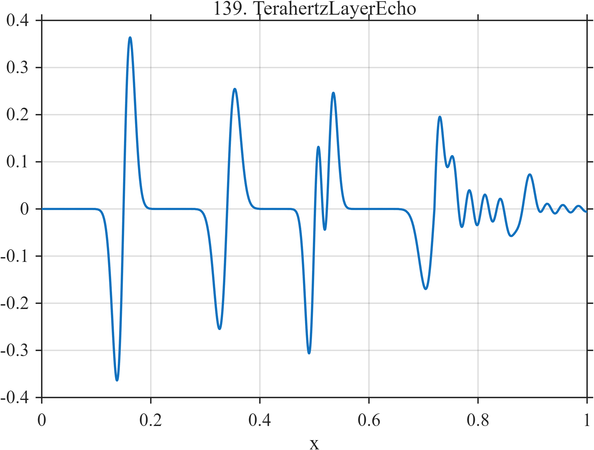

# TF139 — TerahertzLayerEcho

## Overview

The **TerahertzLayerEcho** signal contains six unequal bipolar layer reflections, two closely spaced interfaces, and a weak deep reflection followed by a dispersive oscillatory tail.

## Mathematical Definition

Let $z_k=(x-c_k)/w_k$. Then

$$
f(x)=\sum_{k=1}^{6}a_k z_k e^{-z_k^2/2}+0.07I(x\ge0.72)e^{-9(x-0.72)}\sin[2\pi\,35(x-0.72)],
$$

where

$$
c=(0.15,0.34,0.50,0.525,0.72,0.88),
$$

$$
a=(0.60,0.42,0.50,0.40,0.28,0.11),\quad
w=(0.012,0.014,0.010,0.010,0.016,0.012).
$$

## Morphological Characteristics

| Property | Description |
|---|---|
| Primary family | Bipolar echoes with close interfaces and dispersive tail |
| Close pair | Centers at 0.50 and 0.525 |
| Deep reflection | Weak amplitude 0.11 at $x=0.88$ |
| Main challenge | Resolving close bipolar echoes while retaining a weak tail |

## Parameters

| Parameter | Meaning | Default |
|---|---|---:|
| $c_k,a_k,w_k$ | Echo centers, amplitudes, and widths | As above |
| $9,35$ | Tail decay and cycle frequency | As shown |

## MATLAB Implementation

~~~matlab
N=1024; x=linspace(0,1,N); f=zeros(size(x));
c=[0.15 0.34 0.50 0.525 0.72 0.88]; a=[0.60 0.42 0.50 0.40 0.28 0.11];
w=[0.012 0.014 0.010 0.010 0.016 0.012];
for k=1:numel(c)
    z=(x-c(k))/w(k); f=f+a(k)*z.*exp(-0.5*z.^2);
end
u=max(x-0.72,0); f=f+(x>=0.72).*0.07.*exp(-9*u).*sin(2*pi*35*u);
plot(x,f); grid on; title('TF139 — TerahertzLayerEcho')
exportgraphics(gcf,'TF139_TerahertzLayerEcho.png','Resolution',300);
~~~

## Python Implementation

~~~python
import numpy as np
import matplotlib.pyplot as plt
N=1024; x=np.linspace(0,1,N); f=np.zeros_like(x)
c=[.15,.34,.50,.525,.72,.88]; a=[.60,.42,.50,.40,.28,.11]; w=[.012,.014,.010,.010,.016,.012]
for ck,ak,wk in zip(c,a,w):
    z=(x-ck)/wk; f+=ak*z*np.exp(-.5*z**2)
u=np.maximum(x-.72,0); f+=(x>=.72)*.07*np.exp(-9*u)*np.sin(2*np.pi*35*u)
plt.plot(x,f); plt.grid(alpha=.3); plt.tight_layout()
plt.savefig('TF139_TerahertzLayerEcho.png',dpi=300)
~~~

## Recommended Uses

- Terahertz-layer-profile denoising
- Bipolar-interface resolution
- Weak-tail preservation

## Provenance

**Status:** Terahertz-layer-imaging-inspired deterministic surrogate.

---

[← Previous: MicrofluidicDropletTrain](TF138_MicrofluidicDropletTrain.md) | [Category 8 Catalog](index.md) | [Next: BridgeStrainEvent →](TF140_BridgeStrainEvent.md)
